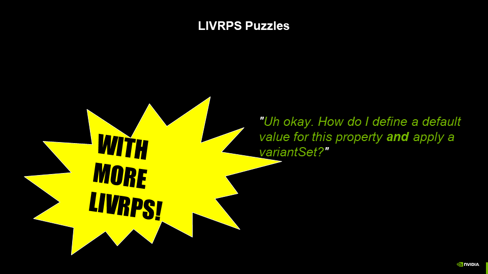
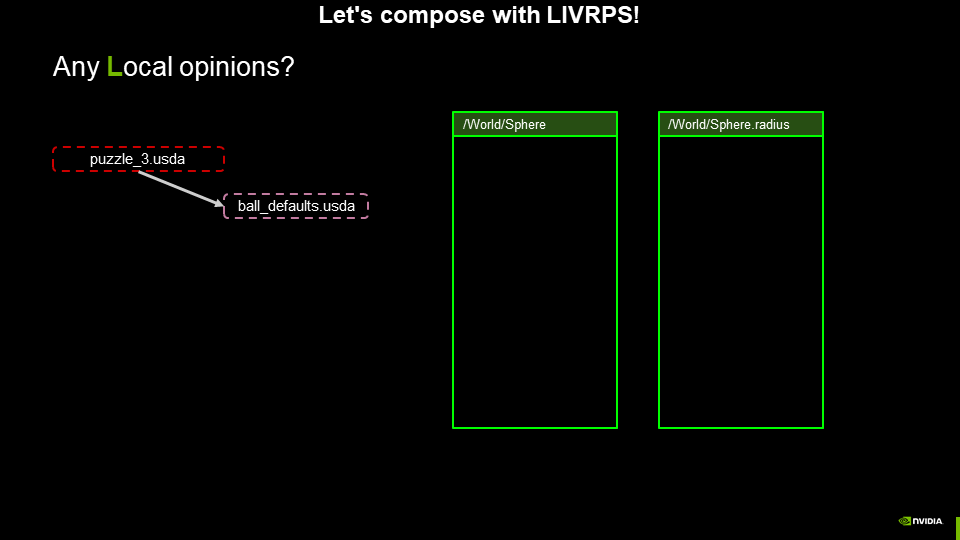
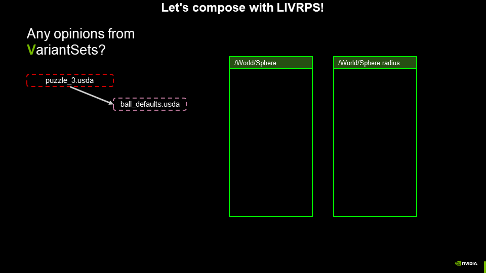
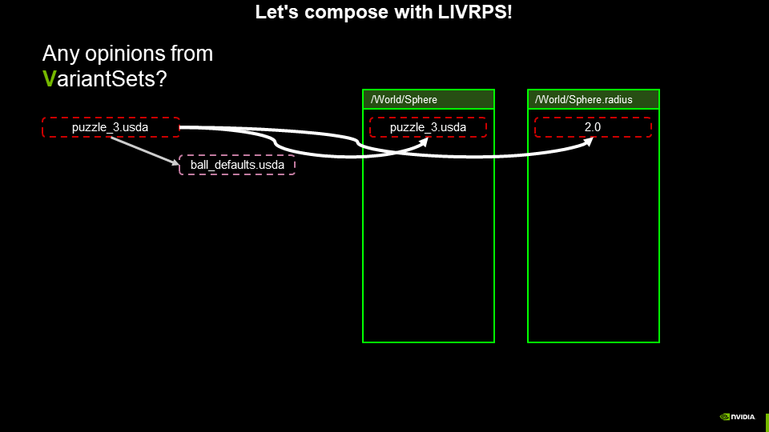
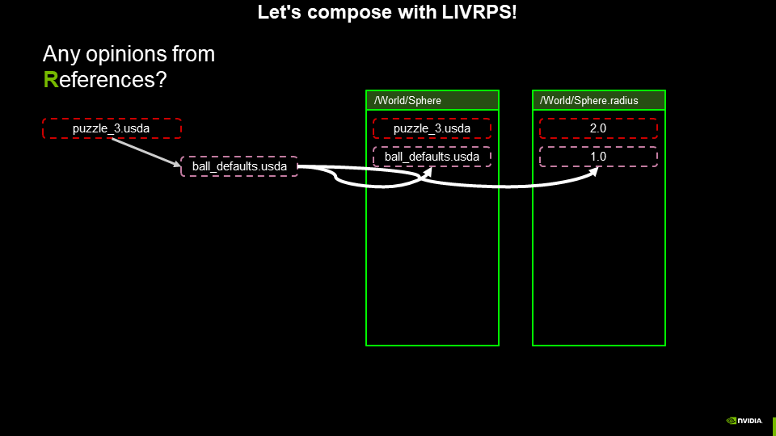
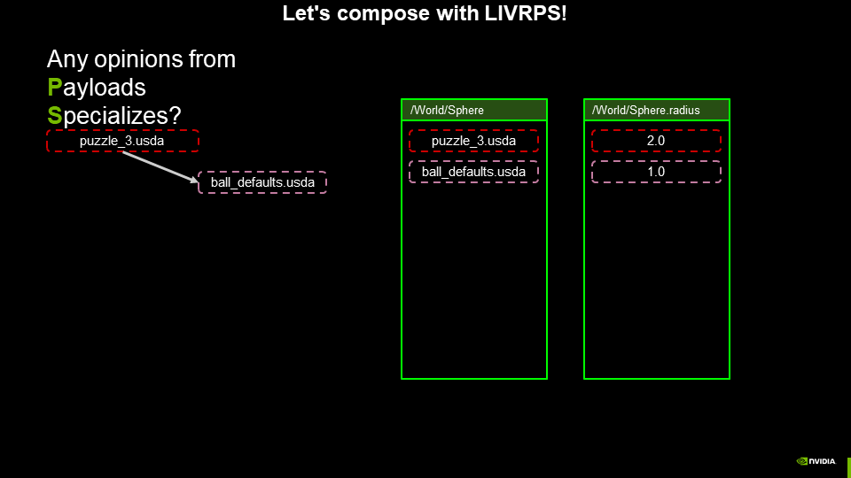
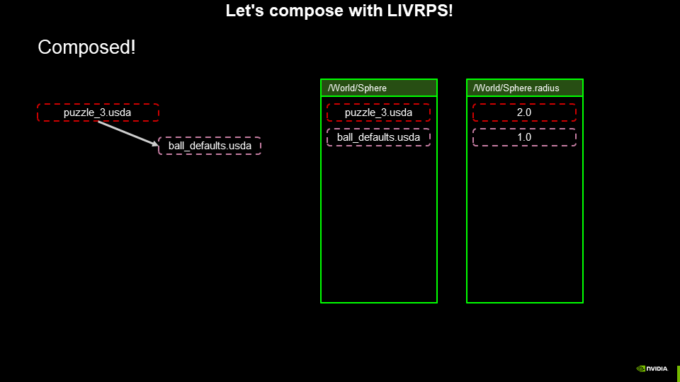

# VariantSet with Local opinion - a possible solution

In the VariantSetAndLocal1 puzzle, defining a VariantSet and a Local default
value for a property within the same prim yielded a composed result where
the Local default value would always be the strongest opinion.

In the VariantSetAndLocal2 puzzle, separating the VariantSet into a stronger
sublayer than the Local default opinion _still_ yielded a composed result where
the Local default value would always be the strongest opinion. Even with
the VariantSet in a strong sublayer, Local opinions are still strongest within a LayerStack.

So, how can we structure this scene so that the opinion in the VariantSet takes precedence over the "default value" Local opinion for the property? The answer is to **USE MORE LIVRPS**.

One possible solution is to structure the data so that the "default value" Local opinion of the sphere is added by a Reference. Let's evaluate LIVRPS and see how this works out.

Note that the initial LayerStack now consists only of `puzzle_3.usda` - the referenced layer is not part of the initial LayerStack, because it is not a _sublayer_ of `puzzle_3.usda`.

Are there any Local opinions on the initial layer stack? Remember,
`puzzle_3.usda` is now the entire initial layer stack for this asset.
So the answer is no, there are no Local opinions on this layer stack.

Are there any opinions form Inherits on this layer stack? No.

Are there any opinions form VariantSets on this layer stack? Yes!

The opinion from the VariantSet in `puzzle_3.usda` is composed as the
strongest opinion for the property and prim spec stacks.

Are there any opinions from References? Yes! The
`/World/Sphere` prim has a reference to the `ball_defaults.usda` file.

The Local opinion from the Reference to `ball_defaults.usda` is composed
as the next strongest opinion on the prim and property spec stacks.

Are there any opinions from Payloads or Specializes? No and no.

The composition is complete, and the opinion from the VariantSet is finally stronger than the "default value" Local opinion for the sphere it is meant to override.
