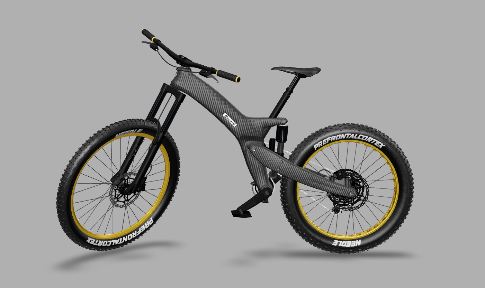
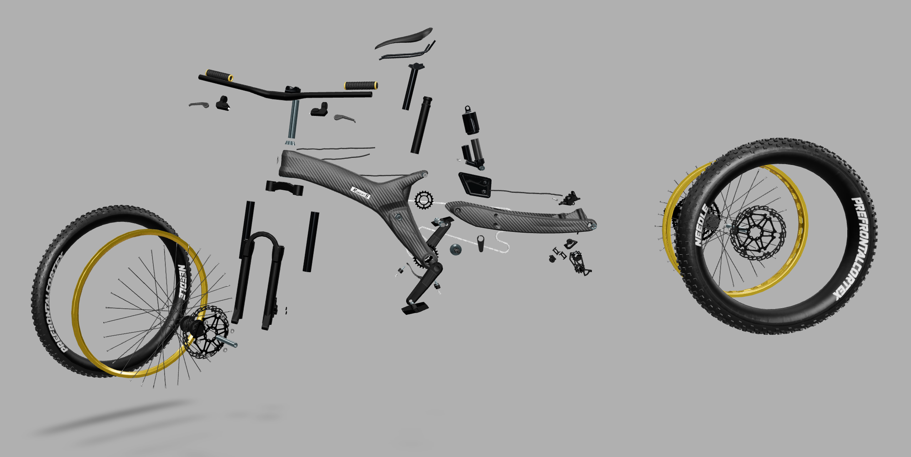
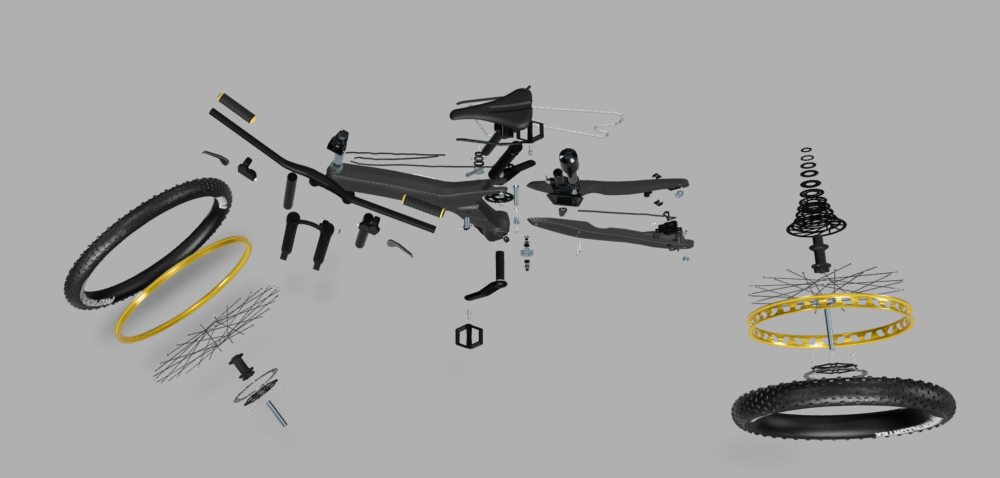
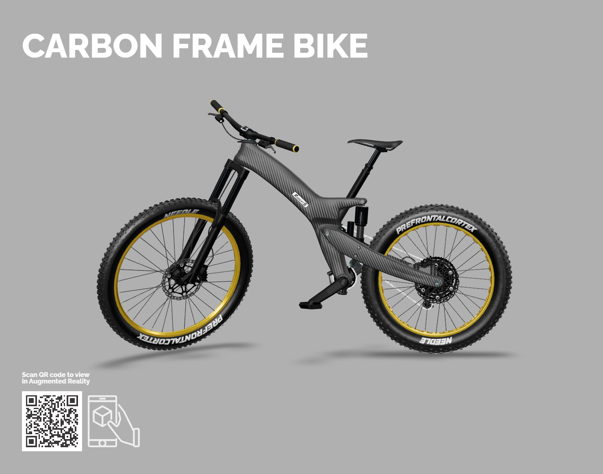

# Carbon Frame Bike

## Video

---

_Explosion View Loop_

## Screenshot

  
_Side View_  

  
_Explosion View_  

  
_Top View_  

## QuickLook / Augmented Reality

[Link to Interactive Version](https://prefrontalcortex.de/labs/model-viewer/upload/CarbonFrameBike/) – Browser uses glTF, iOS AR uses USDZ  

Open this page on iOS and click on the image:  
On Mac OS, if you download the file it can be viewed with audio directly from Finder.  

## Description

This is a production model a mountain bike, with a focus on correct playback in Apple's USDZ QuickLook.  
It contains lots of animated parts, skeletal animation for the wires, and materials using UsdTransform2d.  
The textures are a mix of pre-baked (baked tiling) and tiled textures using UsdTransform2d.  

## License Information

Bike Model by [Robert Schweier](http://www.roberts-bikes.de/).  
Realtime version and animation by Felix Herbst / [prefrontal cortex](https://prefrontalcortex.de) with additional support from [Needle](https://needle.tools).  

>   
"Carbon Frame Bike" by [Robert Schweier](http://www.roberts-bikes.de/) and [prefrontal cortex](https://prefrontalcortex.de) is licensed under a [Creative Commons Attribution-ShareAlike 4.0 International License](http://creativecommons.org/licenses/by-sa/4.0/).  