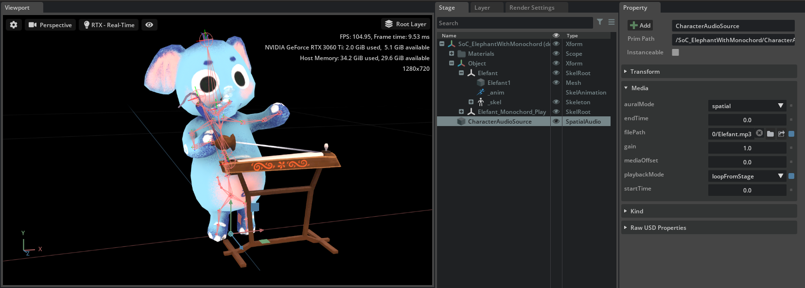

# Songs of Cultures – Vietnamese Elephant with Monochord

## Video

https://user-images.githubusercontent.com/2693840/172025793-d4898e67-8640-47ab-ad8a-36d05375f08d.mp4  

_Video with Audio_

## Screenshot

  
_NVidia Omniverse CREATE: skeletal hierarchies and UsdAudio spatial audio_

## QuickLook / Augmented Reality

Open this page on iOS and click on the image:  
On Mac OS, if you download the file it can be viewed with audio directly from Finder.  

## Description

This production model is designed for Augmented Reality playback via Apple's QuickLook.  
It contains both Skeletal Animation on two meshes (elephant and monochord) as well as [UsdAudio](https://graphics.pixar.com/usd/release/wp_usdaudio.html) data.  

## Shading

The model uses the same texture for `diffuseColor` and `emission`. This creates an apperance of being "unlit", with no actual Unlit shading model currently being available in QuickLook.  

## Problem: Audio plays faster/slower

Some viewers ignore audio bitrate and instead assume a specific bitrate. The MP3 used here is an 48KHz file; QuickLook always assumes 48KHz, so 44.1KHz files will play incorrectly.  

## Problem: Only one mesh plays skeletal animation

   
 _usdview: The monochord doesn't play the correct skinned animation._

## Known Issue: Bounds calculations

This model may have incorrect extents. Some viewers may calculate new mesh bounds from the actual skinned data / bones, others may use the provided extents data and thus show only a small part by default.  

  
_usdview: Extents leading to wrong start view. Note the small displayed box gizmo in the center of the model._

## License Information

This asset has been kindly donated by [A.MUSE – Interactive Design Studio](https://amuse.vision) from their project [Songs of Cultures](https://songsofcultures.com/en/).  
USDZ version by Felix Herbst / prefrontal cortex

>   
"Songs of Cultures – Vietnamese Elephant with Monochord" by [A.MUSE – Interactive Design Studio](https://amuse.vision) is licensed under a [Creative Commons Attribution-ShareAlike 4.0 International License](http://creativecommons.org/licenses/by-sa/4.0/).
