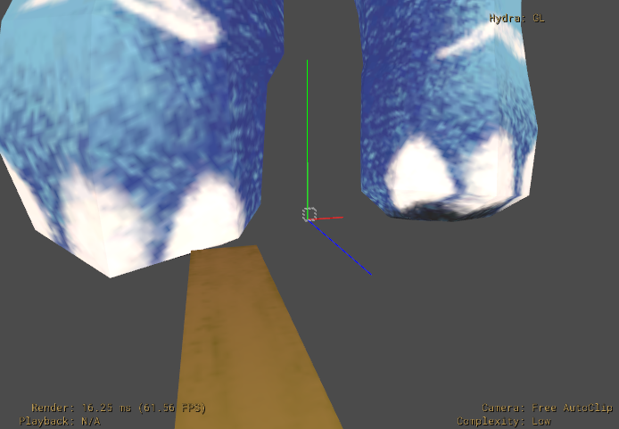

# Songs of Cultures – Vietnamese Elephant with Monochord

## Video

screenshots/20220604-video.mp4  
_Video with Audio_

## Screenshot

  
_Oniverse CREATE with skeleton hierarchies and UsdAudio_

## Description

This production model is designed for Augmented Reality playback via Apple's QuickLook.  
It contains both Skeletal Animation on two meshes (elephant and monochord) as well as [UsdAudio](https://graphics.pixar.com/usd/release/wp_usdaudio.html) data.  

Live web version: [songsofcultures.com/en/ar-collection](https://songsofcultures.com/en/ar-collection)

## Shading

The model uses the same texture for diffuseColor and emission. This creates an apperance of being "unlit", with no actual Unlit shading model currently being available in QuickLook.  

## Problem: Only one mesh plays skeletal animation

   
 _The monochord doesn't play the correct skinned animation here._

## Known Issue: Bounds calculations

This model may have incorrect extents. Some viewers may calculate new mesh bounds from the actual skinned data / bones, others may use the provided extents data and thus show only a small part by default.  

  
_Extents leading to wrong start view. Note the small displayed box gizmo in the center of the model._

## License Information

The model has been kindly donated by [A.MUSE – Interactive Design Studio](https://amuse.vision) from their project [Songs of Cultures](https://songsofcultures.com/en/).  
USDZ version by Felix Herbst / prefrontal cortex

>   
"Songs of Cultures – Vietnamese Elephant with Monochord" by [A.MUSE – Interactive Design Studio](https://amuse.vision) is licensed under a [Creative Commons Attribution-ShareAlike 4.0 International License](http://creativecommons.org/licenses/by-sa/4.0/).