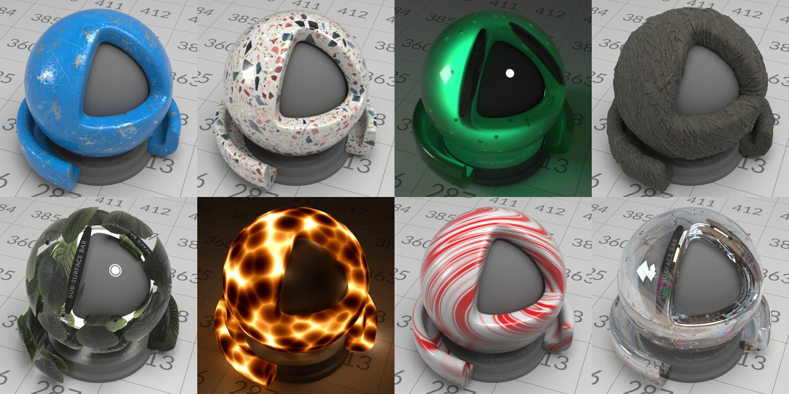
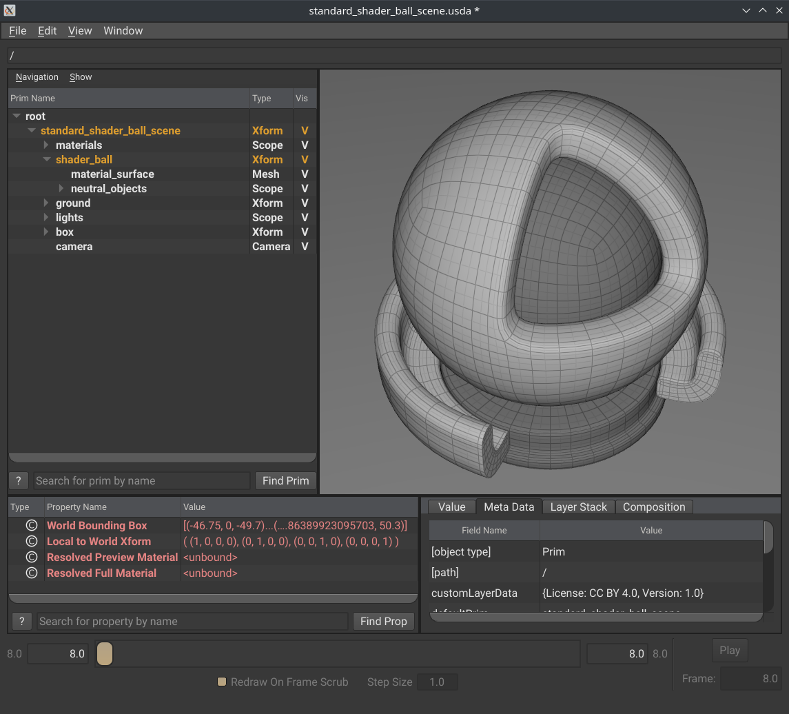
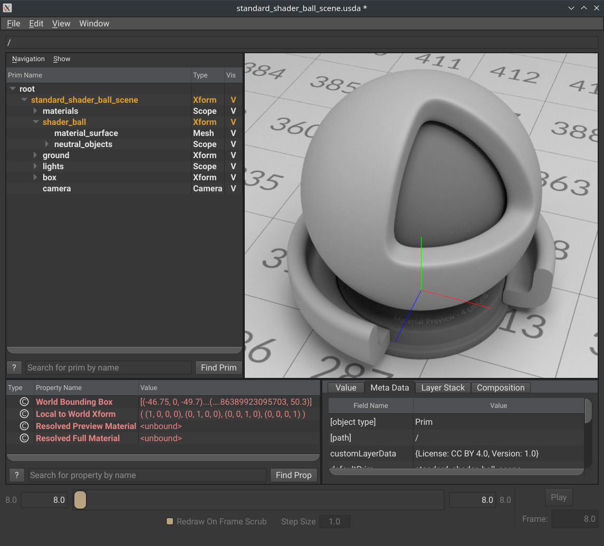
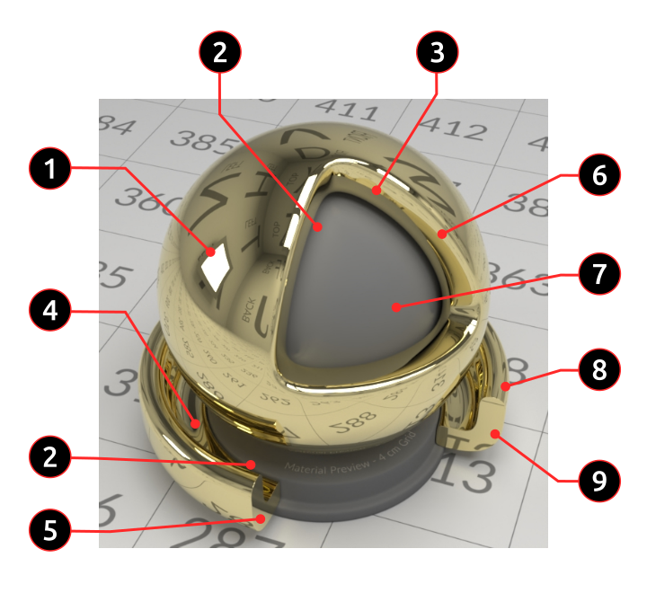
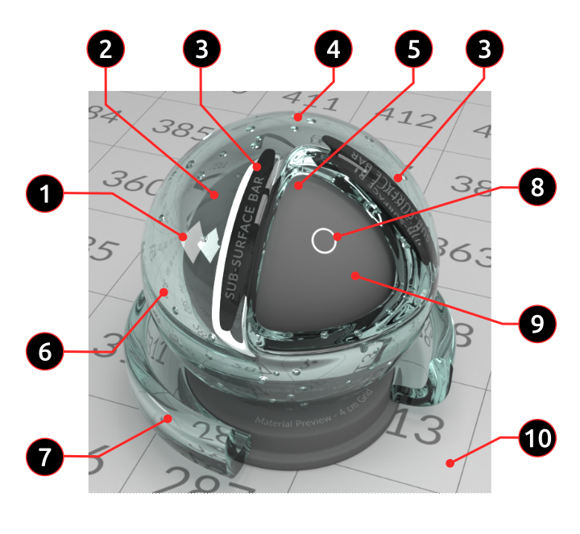
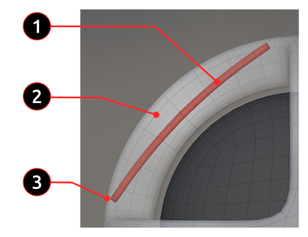
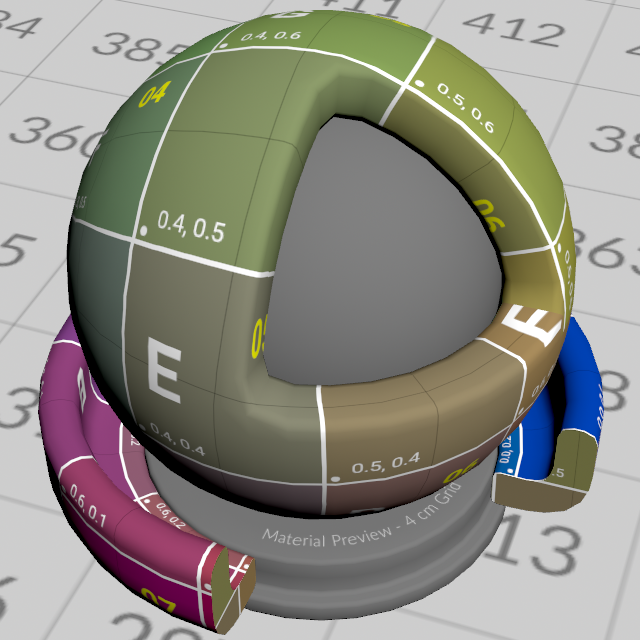
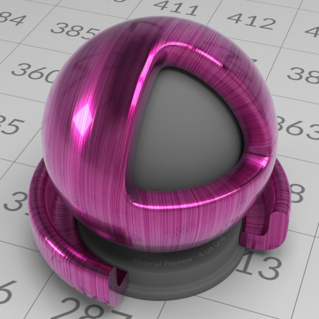
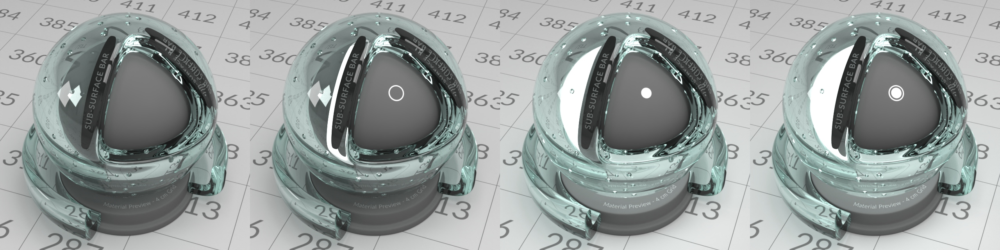
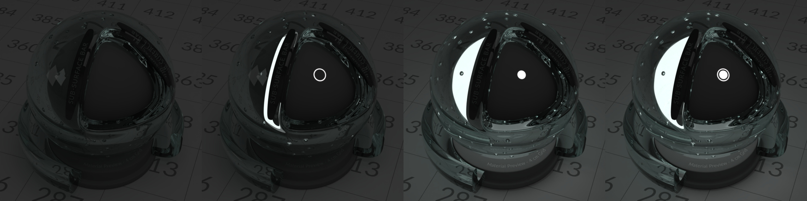

# Overview

This scene is designed to be a comprehensive test of a broad array of
material properties in a single render. It is a scene built completely
from scratch but intended to replicate much of the details found in the
excellent “Simball” or “Material Preview”, originally authored by Thomas
Anagnostou and created while testing NextLimit’s Maxwell Render. In 2019
the original scene definition was released under a Creative Commons
Attribution-Share Alike (CC BY-SA) licence and can be found here:

[http://rayflectar.com/p05-Misc/misc.html](http://rayflectar.com/p05-Misc/misc.html)

This reimplementation is intended to use modern modelling and material
standards — geometry is expressed using
[Universal Scene
Description](https://openusd.org) (USD), materials are defined
using [MaterialX](https://materialx.org),
texture maps are provided in
[OpenEXR](https://openexr.com) format and
encoded using the [Academy Color Encoding
System](https://acescentral.com)
[ACEScg](https://docs.acescentral.com/specifications/acescg)
colour-space. In the opinion of the authors, this scene exercises the
broadest range of material properties of any publicly available render
test and the hope is that this can become an industry standard.

# Quickstart

Once USD has been built, and is available in your PATH, the scene can be
opened with the following command:

> *usdview –camera camera
> full\_assets/StandardShaderBall/standard\_shader\_ball\_scene.usda*

Upon initially opening the scene it may appear over-exposed. After
disabling ***View \> Enable Scene Lights***, usdview should look
something like this:

In usdview, if you have a render delegate that supports UsdMaterialX,
the following should result in an image similar to the screenshot below:

  - ***View \> Complexity \> Highest***, to get nice subdivision surfaces

  - ***View \> Enable Scene Lights***, to get the lights back, if you’ve turned them off

  - Select your renderer under ***View \> Hydra Renderer***.

Note: The renders in this doc were produced from Houdini using Karma.

# Scene Overview

The scene consists of four main elements, each with well-defined
dimensions:

  - The main object (*shader\_ball*) with two parts:
    
      - The material surfaces comprise a modified sphere and a
        truncated rim at its base. These objects are designed to
        exercise the target material properties in specific ways.
    
      - The neutral objects, which are placed inside the sphere and
        rim. These are rendered with a diffuse 18% grey material. In
        some configurations the core sphere can be partially removed
        to reveal an internal light.

  - There are lights both external and internal to these objects that
    are designed to exercise various material properties.

  - The enclosing environment provides a standard setting for render
    comparisons. It is a box, with easily identifiable neutral
     textures on the walls, floor and ceiling.

  - The render camera has a specific location, orientation and field
    of view that when combined with the lights, enclosing environment
    and render test object, expose other important material
    properties.

# Render Characteristics

Broadly speaking, this scene is designed to test two classes of
materials, those that are purely reflective, and those that can also
transmit light.

### Reflective Materials

Reflective features:

1.  Emitter reflection is useful for judging specular reflectivity and
    roughness.

2.  Reflective caustic areas.

3.  Triangular cutout provides flat reflective surfaces.

4.  Light trap that causes recursive reflections.

5.  Fresnel checkpoint (63° reflectance)

6.  Shell thickness of 9.83mm.

7.  Neutral core, 18% grey.

8.  Rim thickness of 6.25mm.

9.  Fresnel checkpoint 45° reflectance.

### Transmissive Materials

Transmissive features:

1.  Reflections on both outside and inside surfaces with an air bubble
    in between.

2.  Refracted internal core.

3.  Subsurface objects.

4.  Air bubbles.

5.  Refractive caustic area.

6.  Refracted environment.

7.  Attenuation indication with varying transmission distance.

8.  Core emission mode. ◯ ribbon emitter. ● Bulb emitter. ⦿ Both
    emitters active.

9.  Neutral core, 18% grey.

10. Each grid is 4cm×4cm with unique numbers from 001 to 625.

As an additional aid to exercise transmissive behaviour, geometry has
been placed under the surface to act as an opaque occluder. This is
useful for observing the paths of refracted light, as well as the
behaviour of volumetric interaction, e.g. subsurface scattering and
absorption.

Subsurface features:

1.  Subsurface bar object.

2.  Variable material thickness above subsurface bar.

3.  Shallow region.

# Shader Ball

The primary surfaces used for material evaluation are a modified sphere
and a truncated rim around the base. Secondary diffuse surfaces are
provided to receive various types of indirect illumination.

The *surface\_geometry* VariantSet allows the above elements to be
defined by either subdivision or triangulated polygon surfaces. Both
variants are intended to provide equivalent geometry and dimensions.

  - **subdiv**
    
      - Quad-mesh, which is also marked as a *catmullClark*
        subdivision surface.
    
      - Care has been taken to create a UV layout that can be used
        both to exercise spatially varying materials (e.g. surface
        textures) and also provide a coordinate frame for anisotropic
        specular roughness.
    
      - Air bubbles are represented as inverted faces inside of the
        mesh.

  - **triangulated**
    
      - A tessellated version of *subdiv*, which has Loop-subdivision
        applied to produce the triangulated topology.
    
      - The UV layout should be equivalent to *subdiv*.
    
      - Includes authored per-vertex *normals* attribute to address
        polygonal facetting.

Comparison of the Catmull Clark surfaces and their triangular
tessellations.

A UV layout has been crafted that both aligns with the sphere’s
coordinate axes and attempts to minimise surface distortion.

Surface texture and anisotropic roughness applied to exercise the UV
layout.

# External Illumination

Two external emitters are present in the scene. One is to the
camera-left side of the render test object with the intention to produce
a specular highlight that can be examined for reflectivity and
roughness, both isotropic and anisotropic. A second light is placed
above the render test object with the intention of creating highlights
on and casting caustics from the bevelled edges of the triangular cutout
area.

# Internal Illumination

In addition to the transmissive properties exercised by the external
lights, the interior geometry of the primary material test objects can
be illuminated. Parts of the grey inner core object can be optionally
removed to reveal an interior spherical light. There are three
configurations:

  - *Ribbon* emission removes a strip of the inner sphere which
    follows the shape of the triangular cutout,

  - *Bulb* emission removes the back facing surfaces of the inner
    sphere, and

  - Both the *ribbon* and *bulb* modes can be activated
    simultaneously.

A texture map on the visible front face of the inner core to indicate
which illumination mode is active. By default this internal illumination
is disabled.

This is particularly useful when exercising transmissive materials that
contain visible interior volumetric scattering.

Internal emission features, from left to right:

1.  No internal emission

2.  Ribbon emission ◯

3.  Bulb emission ●

4.  Bulb and Ribbon emission ⦿

# Enclosing Environment

The render test object is enclosed by a box with a base of 100cm×100cm
and height of 75cm. The ground plane, walls and ceiling have unique
textures designed to allow easy identification of reflected or
transmitted rays. On the ground plane is a texture with unique numbers
from 001 to 625 with a grid of 4cm×4cm. The walls and top are each
marked with unique letters as well as a label to indicate which wall is
represented, allowing easy identification of ray paths.

# Material Definitions

USDShade is used to define the materials on the scene objects. Two
*render contexts* are provided:

  - *usdPreviewSurface*: a basic implementation that should work in
    any standard USD implementation, and

  - *MaterialX*: a more sophisticated implementation that uses the
    MaterialX definition of either Autodesk Standard Surface (default) or
    [OpenPBR Surface](https://github.com/AcademySoftwareFoundation/OpenPBR) depending on the selected `material_model` variant.

All materials except for those applied to the primary material test
surfaces are intended to be Lambertian diffuse. In the Autodesk Standard
Surface case, this means that roughness is set to 0 (in the OpenPBR Surface case, this means `specular_roughness` is 0), which should revert
the included Oren-Nayar model to Lambertian.

# Scene Dimensions

The scene adopts the convention of one scene unit equals 1cm. There is
layer metadata to indicate this (metersPerUnit = 0.01).

The dimensions for the geometry in this scene are derived from the
original scene geometry.

  - Sphere: Ø7.53cm diameter, 9.83mm thickness.

  - Rim: Ø8.92cm diameter, 6.25mm thickness.

  - Floor: 100cm×100cm, tile size 4cm×4cm.

  - Walls: 100cm wide, 75cm high.

# Variants

VariantSets provide simple switching mechanisms in the scene. All
variants live on */standard\_shader\_ball\_scene*:

  - **surface\_geometry** — different representations of shader\_ball:
    
      - *subdiv* — subdivision surface
        with inverted faces for air bubbles.
    
      - *triangulated* — a triangulated version of the subdivision
        surface intended for rendering engines that do not support
        subdivision surfaces natively. Where possible the *subdiv*
        variant is preferred.

  - **internal\_emitter** — illumination from inside the material
    surface:
    
      - *off* — no internal
        illumination, just the neutral grey.
    
      - *ribbon* ◯ — strip around the triangular opening for
        illumination.
    
      - *bulb* ● — the internal core is replaced with a bulb, except
        for the exposed face.
    
      - *ribbon and bulb* ⦿ — both ribbon and bulb areas are exposed.

  - **example\_material** — some example materials for demonstrating
    different features of the scene:
    
      - *none* — no material is applied
    
      - *mtlx\_bubblegum* — a material with subsurface scattering
    
      - *mtlx\_glass* — a transmissive dielectric with a slight colour
        tint
    
      - *mtlx\_gold* — a conductor with the appearance of gold
    
      - *mtlx\_plastic* — diffuse material with a layered specular

      - *uvgrid* - simple material with the uvgrid texture

      - *usdpreview\_glass* — a transmissive dielectric with a slight colour
        tint
    
      - *usdpreview\_gold* — a conductor with the appearance of gold
    
      - *usdpreview\_plastic* — diffuse plastic using the material with a layered specular

Additional **material_model** variant sets allow switch the material model used at shading time:

 - *standard\_surface* - Uses Autodesk Standard Surface material model for shading 

 - *OpenPBRSurface* (default) - Uses [OpenPBR Surface](https://github.com/AcademySoftwareFoundation/OpenPBR)

It is applied on the following prims:

 - **/standard_shader_ball_scene/materials** - Container for the shader ball materials

 - **/standard_shader_ball_scene/materials/examples** - Container for the shader ball example materials

 - **/standard_shader_ball_scene/materials/box_base** - Material "template" used as a base for the shading of the environment box

These examples not intended to represent "correct" materials. They are
included for scene configuration testing convenience. Some USD Preview
examples are also provided for render delegates without UsdMtlX support.
See `media/example_materials` for renders of each material using Karma.

In usdview, variants can be set in the Meta Data tab, while
*/standard\_material\_scene* is selected in the outliner.

# Scene Implementation

The initial USD scene authoring was performed in Houdini. While the USD
scene is sufficient to define the test environment, the original Houdini
scene file is also included in the repository in order to facilitate
reproducibility and future modification. The choice of Houdini is not
intended to represent any software preferences on the part of the
authors.

# Differences from the Original

In the original material preview scene, lights were defined with
radiometric units. Since there aren’t yet mechanisms in USD to define
lights in this way, intensity values have been chosen to capture the
intent of the original scene. Adopting physical units might be
reconsidered in the future as more sophisticated lighting configuration
becomes available in USD.

All of the curved surfaces in the scene geometry are now defined with
crease-free subdivision surfaces when the *subdiv* variant is active.
The original scene was constructed of densely tessellated triangles that
were the result of procedural geometry operators and suffered from
various inconsistencies. The authors are aware that subdivision surfaces
cannot represent circular curves or spheres exactly, but the
approximations here are considered adequate for material evaluation. A
triangulated polygon version of the object is still provided but it is
generated from the subdivision surface. The *subdiv* geometry should be
considered the reference geometry and its use if preferred where
possible.

All texture maps have been remade from scratch at higher resolutions and
are encoded in ACEScg AP1 OpenEXR half textures. The original textures
were published as uint8 PNGs with a gamma of 2.22.

The grey material of the render test object’s interior was originally
defined to be 50% grey. We have replaced this with the VFX industry
standard of 18% grey.

This implementation provides a surface UV layout that should allow the
useful display of textured materials. The axes of this texture space can
also serve as the principal directions of a local coordinate space when
anisotropic roughnesses are being exercised.

# Version History

1.0 2023-05-21 First release of USD scene packages with textures and
this specification document.
1.1 2024-02-23 Changed the geometry winding order to right-handed, which
should render the same for packages that support both winding orders. Also
added normals to triangulated surface geometry. Camera transform clarified.
1.2 2025-07-25 Added `material_model` variant set to switch between 
Autodesk Standard Surface or OpenPBR Surface.

# Contributors

Geometry and textures: Chris Rydalch

Specification and validation: André Mazzone

Original scene, inspiration and consultation: Thomas Anagnostou

For support and questions please use the issues
page.

[https://github.com/usd-wg/assets/issues](https://github.com/usd-wg/assets/issues)

# Licence

Shield: [![CC BY 4.0][cc-by-shield]][cc-by]

This work is licensed under a
[Creative Commons Attribution 4.0 International Licence][cc-by].

[![CC BY 4.0][cc-by-image]][cc-by]

[cc-by]: http://creativecommons.org/licenses/by/4.0/
[cc-by-image]: https://i.creativecommons.org/l/by/4.0/88x31.png
[cc-by-shield]: https://img.shields.io/badge/License-CC%20BY%204.0-lightgrey.svg
