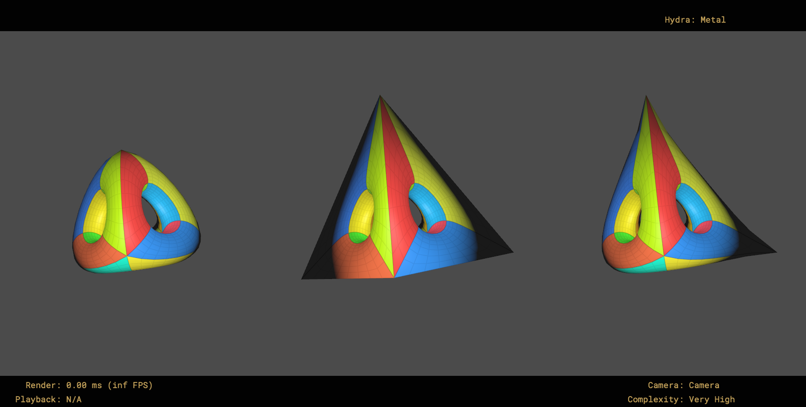

# Subdivision Surfaces

Scenes and geometry demonstrating subdivision surface features in USD.

## Creases - Spinning Pyramids

Provides 3 spinning subdivs demonstrating creases on the Pyramid model:
* `/World/Pyramid_EdgeCreases` - Sharpens the outer edges
* `/World/Pyramid_CornerCreases` - Sharpens two points
* `/World/Pyramid_NoCreases` - Subdiv without creases for comparison

