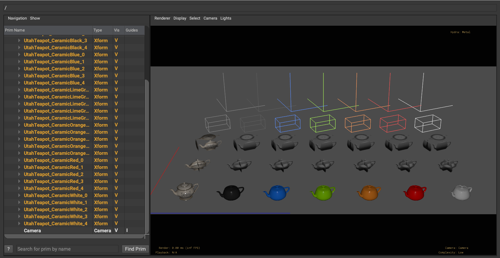
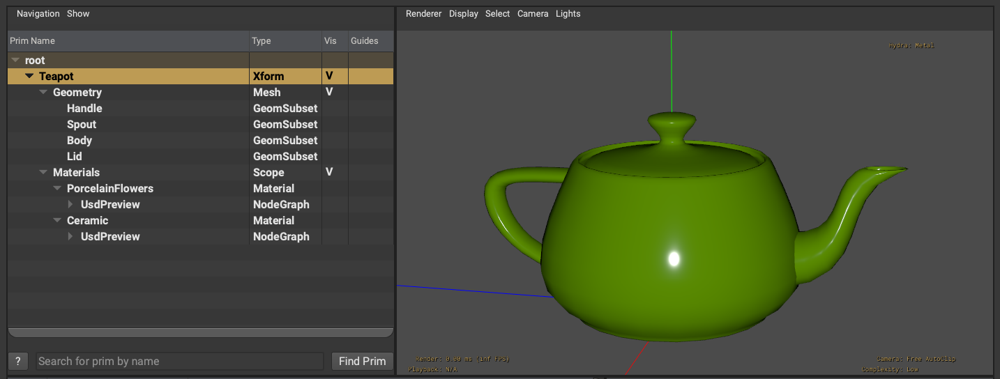
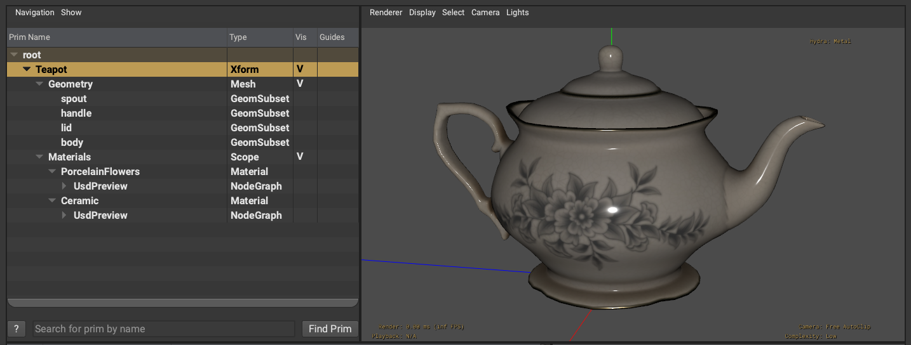

# Teapot Model

File: `DrawModes.usd`

A model of the classic Utah Teapot, with other Teapot variations.

## Details

The Teapot asset is a [model](https://openusd.org/release/glossary.html#usdglossary-model), specifically a [component](https://openusd.org/release/glossary.html#usdglossary-component). Among the other expected features of a component (such as a payload), it demonstrates properly configured draw modes. Also represented are geomsubsets, model and shading variants, and [UsdPreviewSurface 2.4 materials](https://graphics.pixar.com/usd/release/spec_usdpreviewsurface.html).

Draw Mode provides a light-weight representation of models in a scene, while still providing useful information and context to the viewer. When lofted outside of a payload, draw mode can provide a rich representation for unloaded models.

The `DrawModes.usd` scene demonstrates all of the various draw mode options in the asset.

For technical details on draw mode, see the [UsdGeomModelAPI documentation](https://openusd.org/dev/api/class_usd_geom_model_a_p_i.html#details).

### modelVariants

 
File: `Teapot.usd`

The _modelVariant_ variant contains two options: Utah and Fancy. Each references its corresponding geometry layer stored in the `geo` folder.

When _drawMode_ is set to "cards", each model variant has one set of texture maps. these are all stored in the `cards` folder. Both "box" and "cross" options are demonstrated with all axes.

### shadingVariants

Each model variant has its own set of shading variants. _drawModeColor_ is setup to reflect the different shadingVariants.

All texture maps are stored in the `textures` folder.

## Ideas for Future Contributions

* Python script to produce and configure the images using `usdrecord`
* Add _fromTexture_ card mode example
* 1- or 2-axis card examples
* Create texture cards for every permutation of model and shading variants
* Other examples of draw mode for assembly models
* Provide richer examples of materials, perhaps using UsdMaterialX

## Sources

The asset was produced by Chris Rydalch at [SideFX Software](https://www.sidefx.com/), with feedback from the Houdini and USD communities.

The original Fancy Teapot data was part of the [Tea Set](https://polyhaven.com/a/tea_set_01) created by James Ray Cook, Jurita Burger, and Rico Cilliers at PolyHaven. They generously made it available under a Public Domain - CC0 license.

## License

Public Domain - CC0
