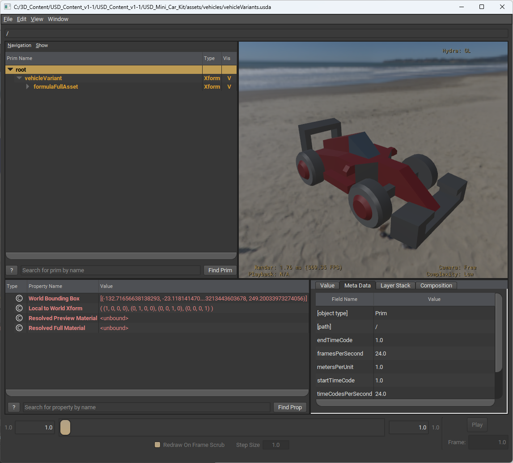
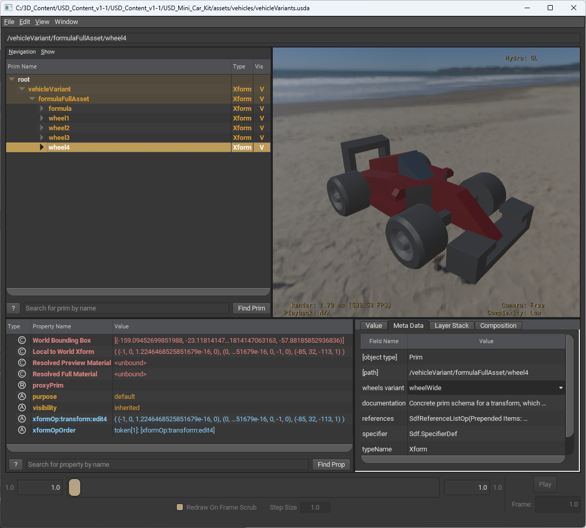

# RYStorm USD Example Assets

A setup of various USD files that make up vehicles and wheels. Includes variants that can be switched between. File size around 1MB, so it is very quick to test and edit. Intentionally made as a very small, simple, and easy to understand usecase of a USD setup that anyone can pick apart to see how it works. 

Originally made in relation to my article on how USD can be difficult to understand: https://rystorm.com/blog/i-would-like-usd-to-succeed

Then clarified to be as simple to understand as possible in this video: https://www.youtube.com/watch?v=JixC53cQn5U

The intention is that anyone can watch this, and understand how this setup works, and why. Then they can download it, view it, and experiment with it to see how it works. The prime target audience is artists, designers, producers, and managers who are all not technical.

Asset as seen in USDView:

Or show the variant of a formula car:

And you can also individually change out each wheel to other variants:

These assets also all quickly and easily open in various other DCCs such as Maya:

Blender:

And 3dsMax:

## License

(Creative Commons Zero, CC0)
http://creativecommons.org/publicdomain/zero/1.0/

## Credits

Assets modified and edited by Robin-Yann Storm https://rystorm.com/ into USD.
Email contact at storm@rystorm.com
3D assets originally made by Kenney https://kenney.nl/

This is v1.1 of this asset pack.
