# intent-vfx

The intent of this structure is to be an initial guide to one of the many possible ways in which assets and scenes can be described in OpenUSD, trying to answer to some of the VFX-pipeline workflow requirements.

The full description of where this structure is starting from can be found in the `docs` of this repo.

## VFX workflow requirements

### Contributions from various departments

The very first requirement is to be able to describe the content with layered content, usually contributed by various departments in a non-destructive manner.

### Granularity

Content should be granular enough to allow for per-shape shading and/or geometric opinions.

### Scriptable

Creation and/or edits should be scriptable using OpenUSD API (Sdf, Usd, etc).

Scripts for example use-cases are more than welcome.

### Instancing

Explicit and implicit instancing (PointInstancers and native-instancing via instanceable metadata) should be used to provide example of how to apply edits (for materials or geometry or anything else) via composition-arcs and retain instanceability.

### Large scene scalability

Together with instancing, also providing various representations and/or LODs for various purposes will help handling large scenes, and allow for scalable structures in the future ( e.g. alternative representations of larger layouts could be provided as variants for specific purposes ).

### Type and Kind hierarchy

Simple but useful type and kind hierarchy to allow for better interrogability and usability.

### Files and folders structure

A simple structure, with ability to re-use and share assets or contributions across assets (textures, materials) could be a plus.

Quite often this is very specific to pipelines and it might be the very first thing you want to change if starting from these guidelines.

## Not accounted for

Versions are usually very specific to pipeline, so we are not handling those here.

Assets and scenes are always on latest, history is only provided as git-history by the repo.

## Assets generation

There are two scripts to generate a `simpleAsset` and a `teapot` asset, and they are almost identical scripts.

The `simpleAsset` has 2 purposes, with a `cube` for the `proxy` purpose, and a `sphere` for the `render` purpose.

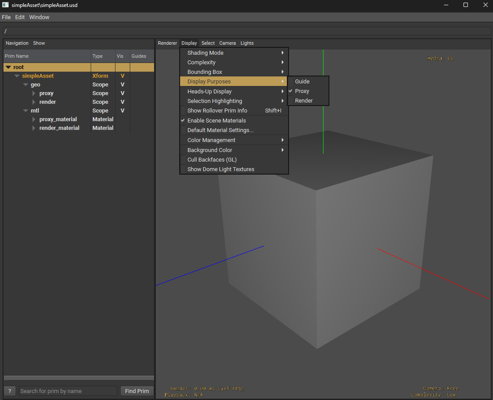


The `teapot` asset has only a `default` purpose.

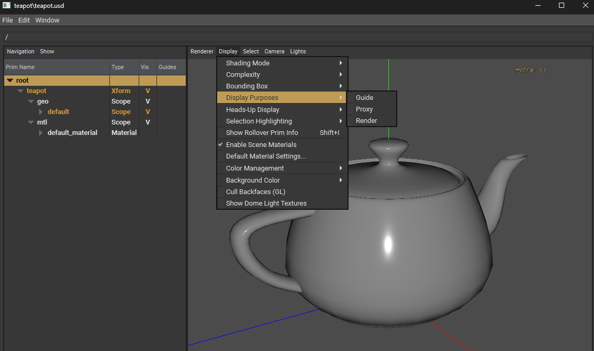

To run the script

```
cd assets/teapot
python ../../build_teapot.py
```

or

```
cd assets/simpleAsst
python ../../build_simpleAsset.py
```

## Animation Cycle generation

A script has been provided to generate an anim-cycle for the Teapot, via creating an override for the points.

This is an example of an asset-specific animation-cycle, which could be re-used multiple times in a scene, with time-offsets.

To run the script

```
cd assets/teapot
python ../../build_teapot_animcycle.py
```

and this will create a `teapot_animCycle.usd` file alongside the `teapot.usd` file, which will be used in the overrides when building the scene later on.


## Layout generation

There are 2 scripts to generate a layout per asset, in a concentric-ring distribution, having each ring to randomly use PointInstancers or native-instancing for its instances.

Even if there are mixed PointInstancers and individual elements, the layouts are made so that only one implicit prototype is actually created, shared across all elements and PointInstancers prototypes.

To run the script to build the layouts:

```
cd scenes
python ../build_scene_teapot_layout.py
```

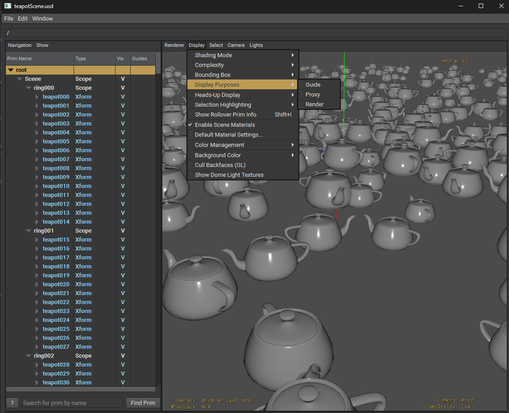

or

```
cd scenes
python ../build_scene_simpleAsset.py
```

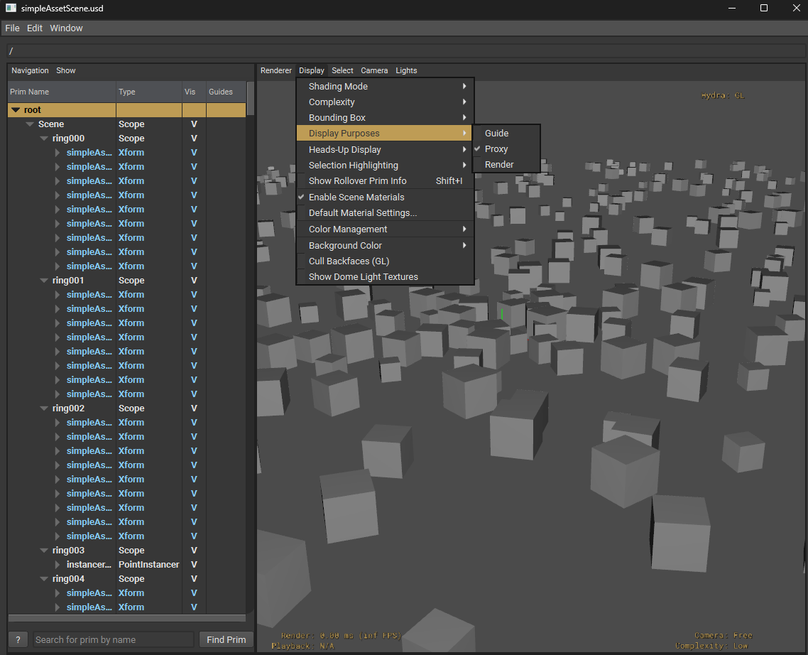

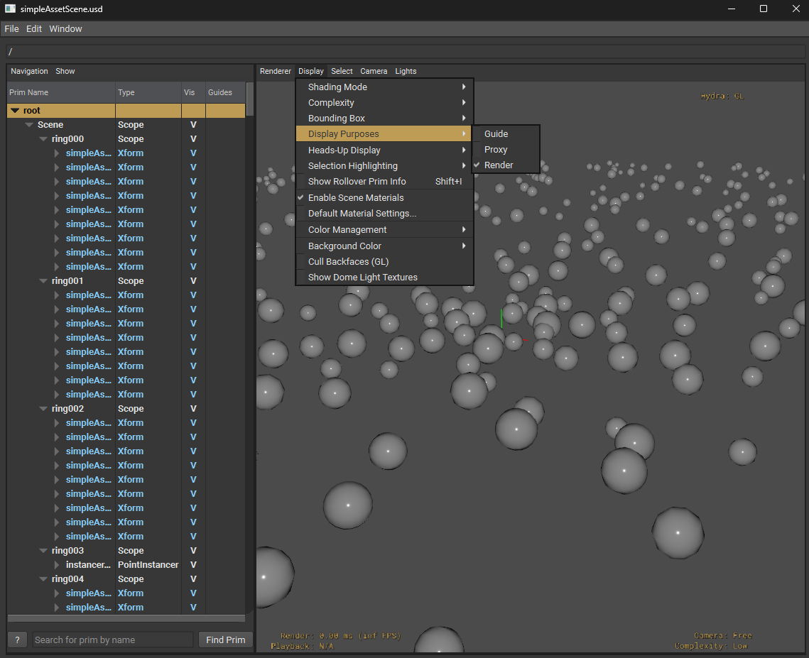

## Material overrides with implicit and explicit instancing

A third script is provided to generate a new-layer for the `teapotScene`, with overrides to materials and geometry, with a controlled implicit prototypes creation, where each set of "overrides" is provided as an abstract prim inherited on elements and PointInstancers where edits are applied.

To run the script to build the overrides:

```
cd scenes
python ../build_scene_teapot_layout_overrides.py
```

This override-scene shows a few examples of how to apply edits on `PointInstancers` or `native-instancing` (instanceable-metadata enabled).

Please note that there are other possible ways to do this.

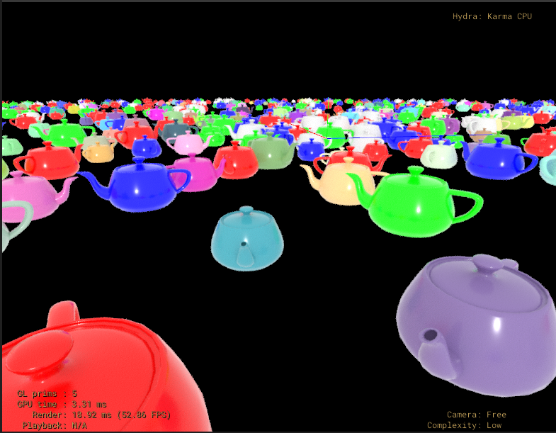

### input parameter override

Three classes are created with overrides for the `inputs:base_color` with values set for `red`, `green` and `blue`.

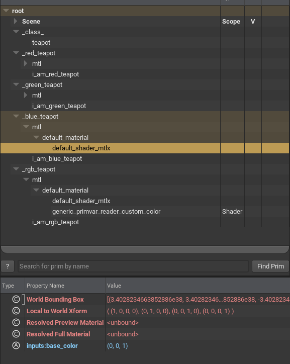

Those classes are inherited randomly on the individual elements with `instanceable` metadata enabled

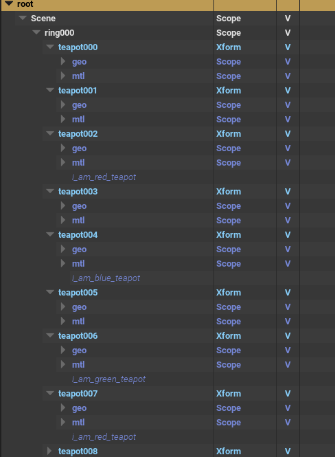

and they are also added as new explicit prototypes to some PointInstancers, also overriding the `protoIndices` to randomly point to these new prototypes

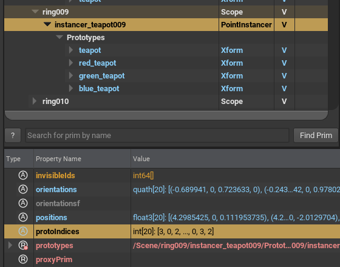

### per-instance primvars with a dedicated material

Another class is created with an override to the `inputs:base_color`, to enable reading a primvar called `custom_color`.

The override on the `inputs:base_color` is to connect that input parameter to a new shader

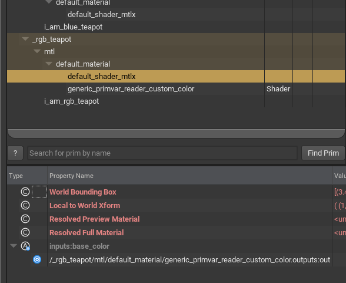

and the new shader is used to read the primvar from the primitive is running on

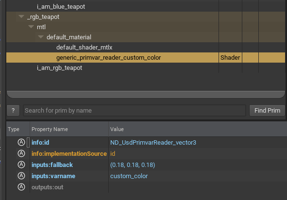

This class `rgb_teapot` allows the same material to be used for PointInstancers (NOTE: this could also be done on instanceable-elements), providing now per-instance primvars with randomly distributed color values, as now the colors are not used to define new implicit prototypes, they are instead provided as per-instance variations (NOTE: renderers will need to support per-instance variations).

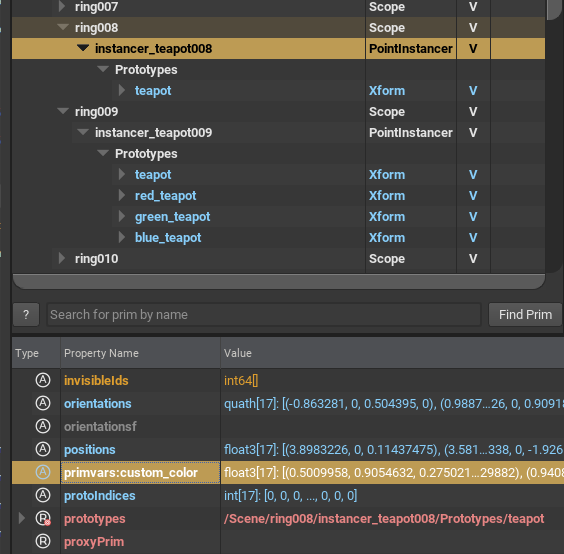

### implicit prototypes handled by OpenUSD and small trick

By adding a new composition-arc on those elements, we are telling OpenUSD to calculate new implicit prototypes.

To notice that we've used a trick here to be able to visually understand which prototype points to which class.

By adding an empty prim with an explicit name in the classes for the overrides

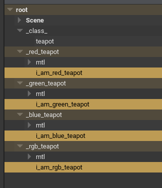

we are going to be able to see in the outliner which elements points to which override


and we can also see where the implicit prototypes are coming from

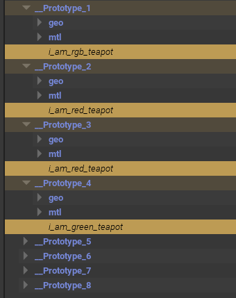

Due to how we've built the overrides (and it is a good exercise to try to redo this differently to "solve" this!) you have noticed that there two implicit prototypes per each colored-override, one shared across all the individual elements and one shared across all the PointInstancers.

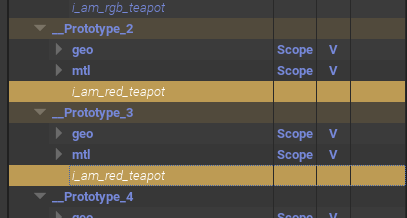

## Camera generation

A script to generate procedurally a simple camera animation is also provide.

To run the script

```
cd scenes
python ../build_scene_teapot_camera.py
```

## Animate the layout

A script is provide to generate anim-cycles variations in the previously generated layout.

To run the script

```
cd scenes
python ../build_scene_teapot_animcycle.py
```

This script will generate a layer providing a random distribution of specific anim-cycle with time-offsets, to control the amount of variations in the scene.

## Generate the scene step-by-step

As an example pipeline for generating all the contributions to the final scene, we can consider the following steps:

```
cd assets/teapot
python ../../build_teapot.py
python ../../build_teapot_animcycle.py

cd scenes
python ../build_scene_teapot_layout.py
python ../build_scene_teapot_layout_overrides.py
python ../build_scene_teapot_camera.py
python ../build_scene_teapot_animcycle.py
python ../build_scene_teapot.py
```

## renders

Note that `Storm` doesn't show the `rgb_teapot` variation, I'm not entirely sure if it is the scene or a bug, I need to follow up (if you know more, please, contribute).

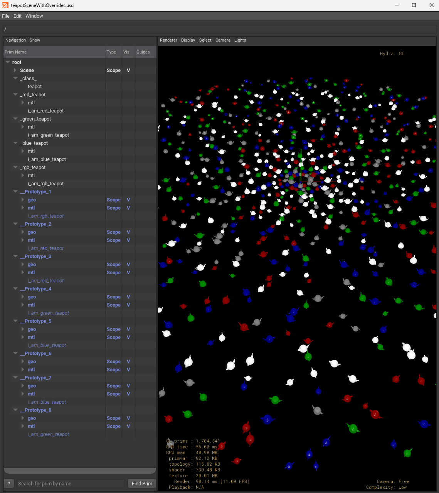

but this is how it should look like, here rendered in Karma, with some of the PointInstancers having a lot more color-variations thanks to the per-instance primvars approach

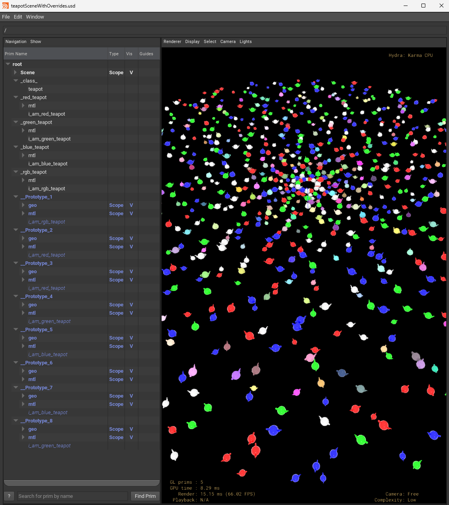