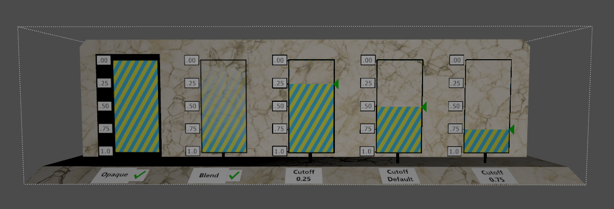
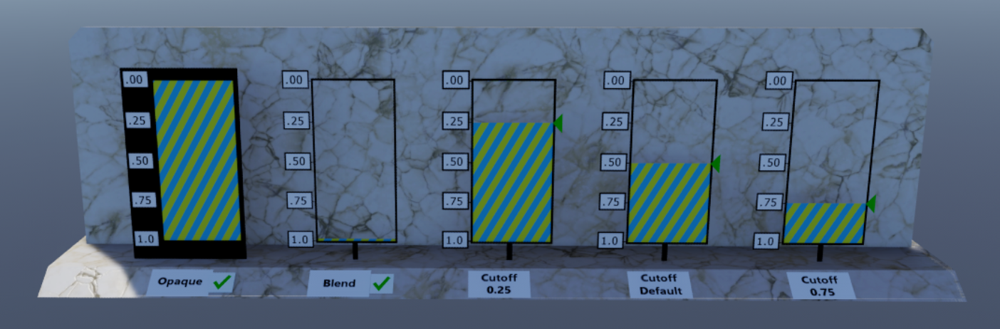

# Alpha Blend Mode Test

## Screenshot

_usdview 21-05_

## Description

This model tests UsdPreviewSurface alpha modes and blending, especially the interplay between opacity, opacityThreshold, and diffuseColor.  

It's a conversion from the glTF test asset with the same name found here: https://github.com/KhronosGroup/glTF-Sample-Models/blob/master/2.0/AlphaBlendModeTest/README.md.

_glTF reference_

## Problem: Opacity Values Used in Opaque Mode

 
 _Blender 3.1_

## Problem: Opacity Values combined with opacityThreshold values

 
 _QuickLook on iOS 15.6_

 ## Problem: Incorrect use of default opacityTreshold (?)

 
 _Omniverse VIEW 2022.1_

## License Information

This conversion bears the same license as the [source asset](https://github.com/KhronosGroup/glTF-Sample-Models/blob/master/2.0/AlphaBlendModeTest/README.md).  

Copyright 2018 Analytical Graphics, Inc.
CC-BY 4.0 https://creativecommons.org/licenses/by/4.0/
Model and textures by Ed Mackey.  

Conversion by Felix Herbst.