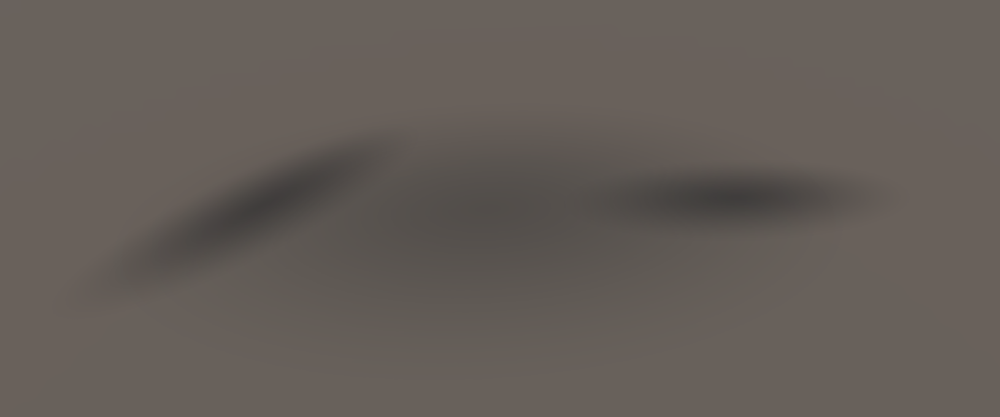
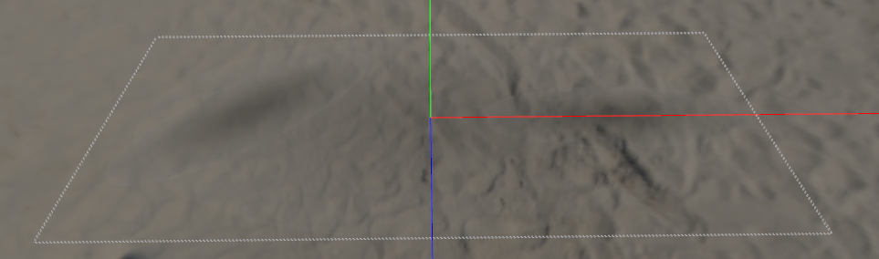
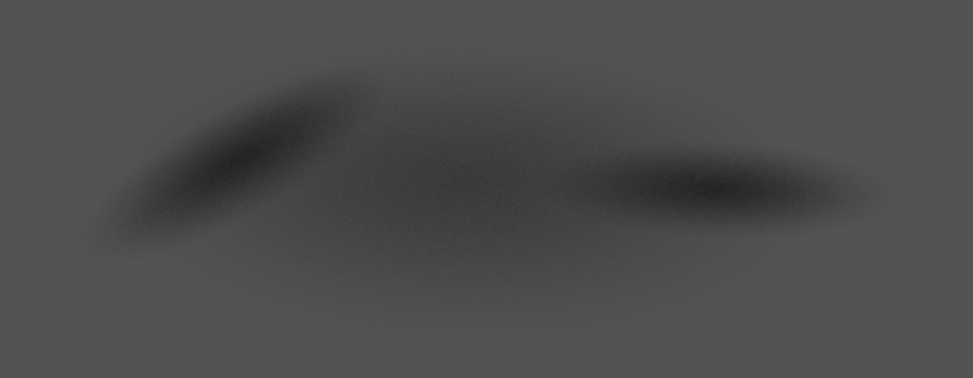

# Alpha Blend Sort Test

## Description

Opacity in UsdPreviewSurface has a number of pitfalls (schema versioning, application of light even when fully transparent, opacityThreshold, etc.).  

This asset tests for and showcases some of the various issues that can happen with that. It may not be possible to render this asset as intended with UsdPreviewSurface (clarification needed) since that always applies lighting even to fully transparent parts of surfaces (e.g. light response on fully transparent glass).

_Reference Image (rendered from the glTF version)_

## Problem: Visible boundaries

If you look closely there are white-ish boundaries visible around the textures.  

   
 _usdview 22.05_

## Problem: Incorrectly interpreted as masked instead of blended

The model is translucent (opacity is set but not opacityThreshold), yet some apps interpret it as cutoff material.

  
 _Omniverse 2021.3.10, Draft Mode_

The image may look correct when rendered with a raytracer.  

  
_Omniverse 2021.3.10, Photo Mode_

## Problem: Incorrect blending of transparent surfaces

The coplanar shadow planes should not write to depth since they are transparent, and should darken each other.  

  
_AR QuickLook AR View_

## Problem: ?

Not sure what's going on here, looks like all surfaces are interpreted as opaque yet rendered partially transparent.  

  
_AR QuickLook Object View_  

## License Information

  
To the extent possible under law, Felix Herbst / prefrontal cortex has waived all copyright and related or neighboring rights to this asset.  