# Payload and reference ordering

This puzzle was inspired by a real-life USD asset structure problem encountered during USD adoption at a large animation studio.

In the studio's production pipeline, before animation begins on a shot, the shot populated with non-deforming models, placed on the stage for blocking.

`shot.usda` has sublayers of `animation.usda` and `layout.usda`. `layout.usda`
has a reference to `model.usda`, the non-deforming model geometry.

Animation performed their work at a later date and delivered their animation caches by adding a payload to their sublayer. When this happened, they didn't see the deforming geometry from animation on the stage.

This scene data looks nothing like real animation data, but for the purpose of demonstration, let's say that modeling creating a sphere with radius 11, and animation published a cache that updated it to 14. The goal is to see animation's contribution as the strongest opinion on the stage. Can you spot the problem? Let's evaluate LIVRPS and see where we went wrong here.

Starting with the LayerStack defined by `shot.usda`, are there any
Local opinions, Inherits, or VariantSets? No, no, and no.

Are there any opinions from References? Yes! 

The Local opinion from the Reference to `model.usda` is composed as the
strongest opinion on the prim and property spec stacks.

Are there any opinions from Payloads? Yes!

The Local opinion from the Payload to `animCache.usda` is composed as the
next strongest opinion on the prim and property spec stacks.

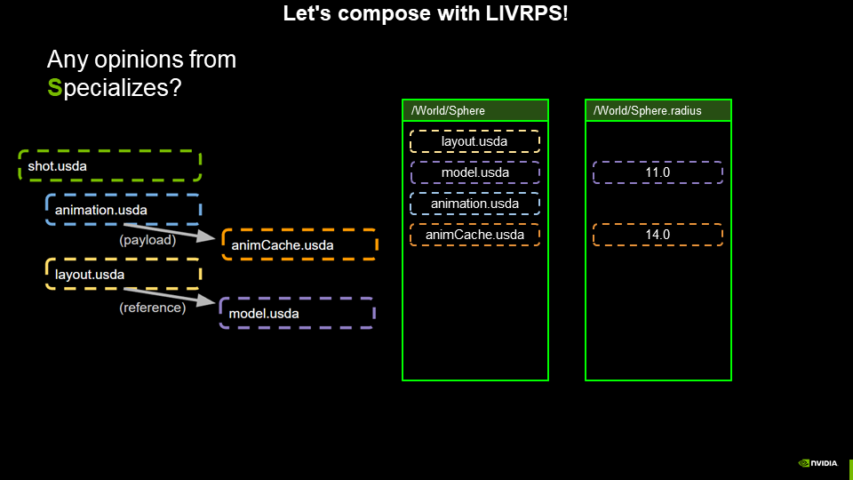

Are there any opinions from Specializes? No.

Our stage is now composed. But, the opinion from animation is **weaker**
than the opinion from modeling! This means that our characters will not
be moving in our final renders.

The problem occurs because modeling data is composed using a reference, and animation data is composed using a payload, so the opinion from the modeling data is stronger on the USD stage. Querying the radius property of the Sphere prim will return the value authored by modeling instead of animation.

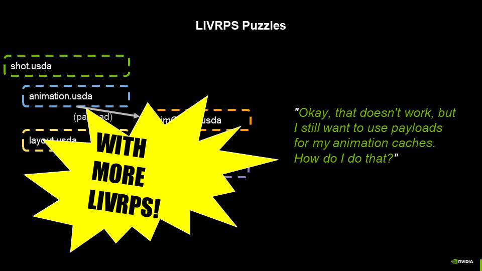

So how can we solve this problem without changing the composition operation for modeling and animation data? The answer is to **USE MORE LIVRPS**.

One approach is to change the structure of the stage so that the payload and the reference are not in the same LayerStack (so that the Reference will not be stronger than the Payload during composition). This can be accomplished by using references in `shot.usda` instead of sublayers. In that way, `animation.usda` and `layout.usda` are evaluated as independent LayerStacks as LIVRPS is applied.

Here's a before and after of `shot.usda`.

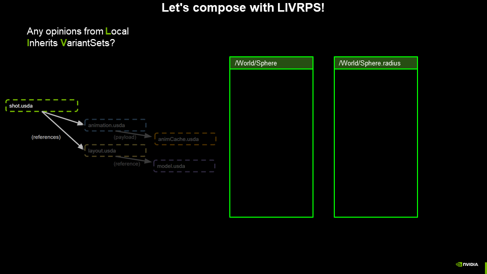

Let's evaluate with LIVRPS to see how this plays out. We'll start with the `shot.usda` LayerStack.

Are there any Local opinions, Inherits, or VariantSets? No, no, and no.

Are there any References? Yes!

Let's evaluate the References in the order they are listed in the LayerStack.

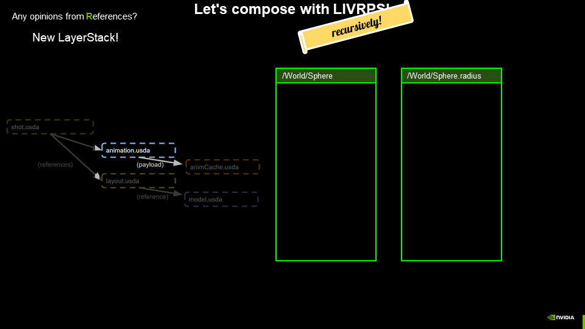

Let's evaluate the LayerStack of the strongest referenced layer, `animation.usda`.

Remember, LIVRPS is applied recursively in each new LayerStack
as it is composed.

Are there any Local opinions, Inherits, or VariantSets? No, no, and no.

Are there any opinions from Payloads? Yes!

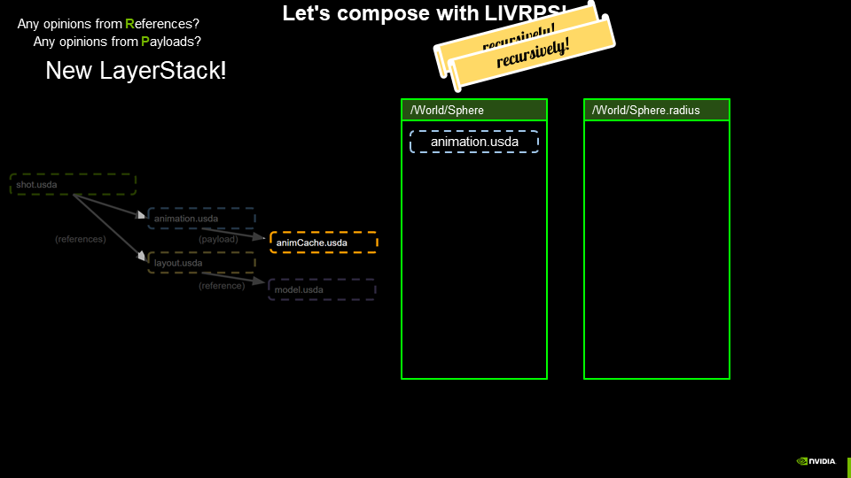

Let's evaluate the LayerStack of the payload, `animCache.usda`.

Remember, LIVRPS is applied recursively in each new LayerStack
as it is composed.

Are there any Local opinions? Yes! 

The Local opinion is applied to the property spec stack as the
strongest opinion.

In the `animCache.usda` LayerStack, are there any opinions from Inherits,
VariantSets, References, Payloads, or Specializes?

No, no, no, no, and no.

The `animCache.usda` LayerStack composition context is complete,
and we will return to the previous LayerStack.

Having evaluated all Payloads in the `animation.usda` LayerStack,
we check if there are any Specializes. No, there are not.

The `animation.usda` LayerStack composition context is complete,
and we will return to the previous LayerStack.

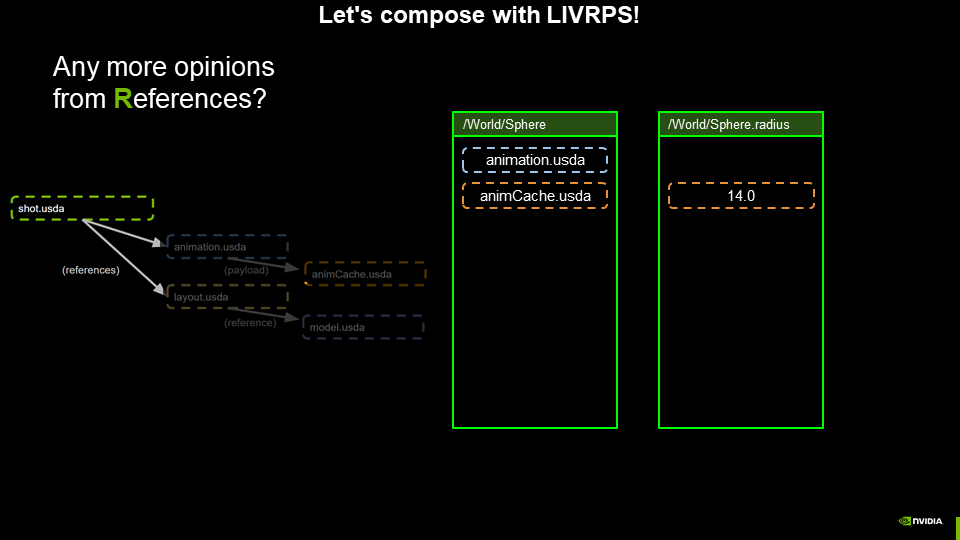

Now, in the `shot.usda` LayerStack, we check for additional References.
And there are! The prim `/World` also contains a reference to `layout.usda`.

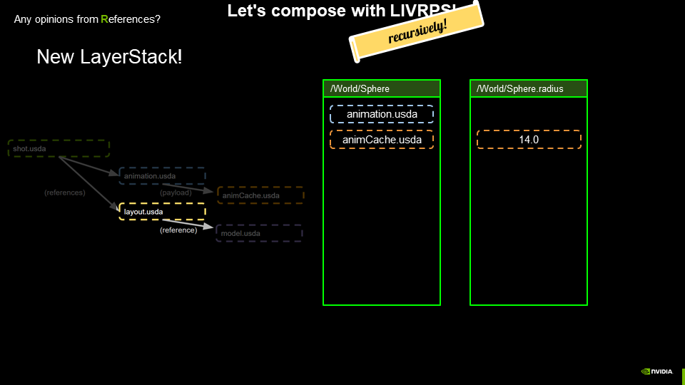

Let's evaluate the LayerStack of the `layout.usda` Reference.

Are there any Local opinions, Inherits, or VariantSets? No, no, and no.

Are there any References? Yes!

Let's evaluate the LayerStack of the referenced layer, `model.usda`.

Remember, LIVRPS is applied recursively in each new LayerStack
as it is composed.

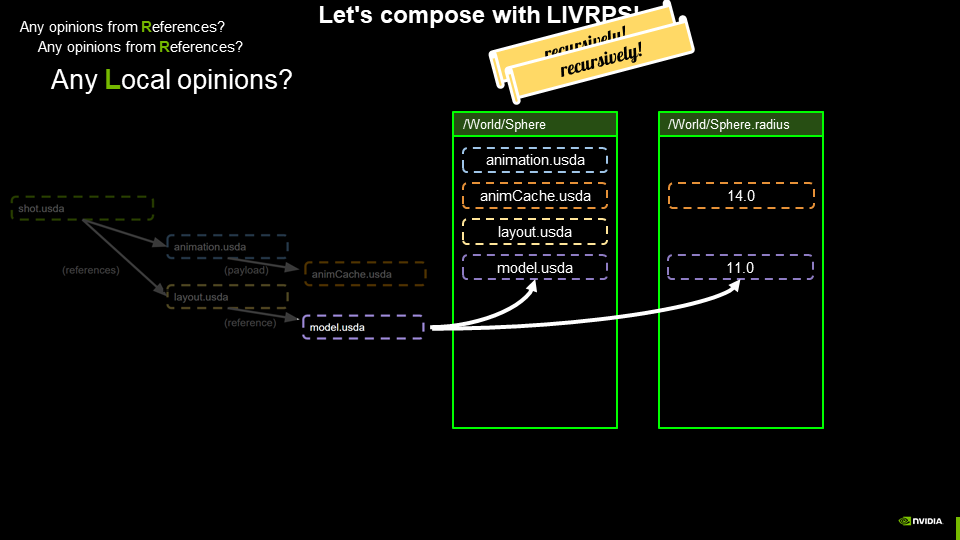

Are there any Local opinions? Yes! 

The Local opinion is applied to the property spec stack as the
second strongest opinion.

In the `model.usda` LayerStack, are there any opinions from Inherits,
VariantSets, References, Payloads, or Specializes?

No, no, no, no, and no.

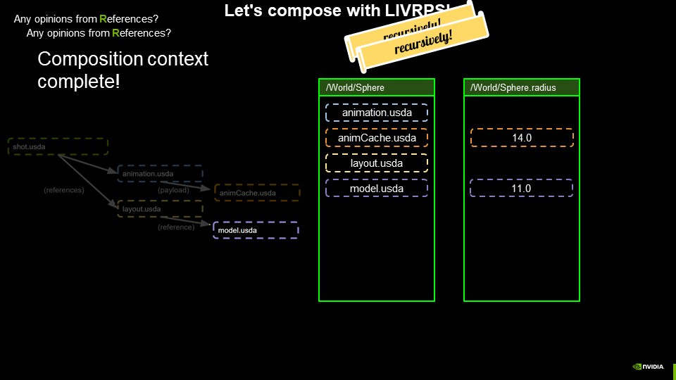

The `model.usda` LayerStack composition context is complete,
and we will return to the previous LayerStack.

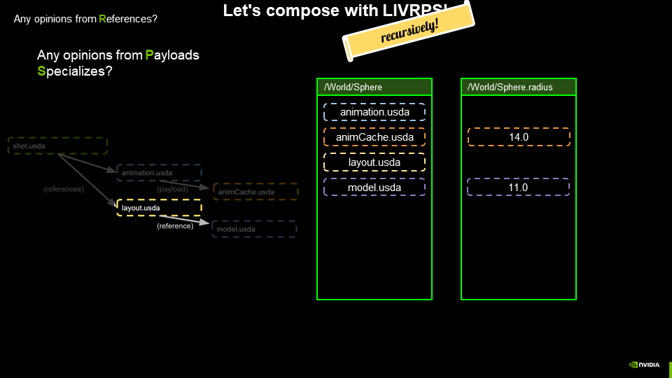

Having evaluated all References in the `layout.usda` LayerStack,
we check if there are any Payloads or Specializes. No, there are not.

The `layout.usda` LayerStack composition context is complete,
and we will return to the previous LayerStack.

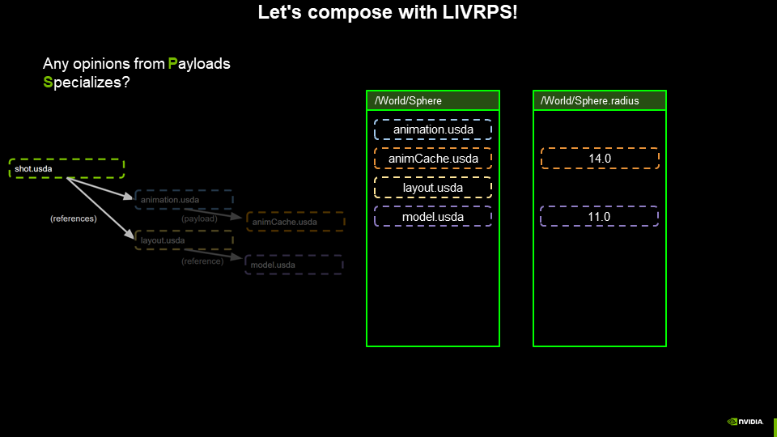

Now, in the `shot.usda` LayerStack, we check for Payloads and Specializes.
There are neither.

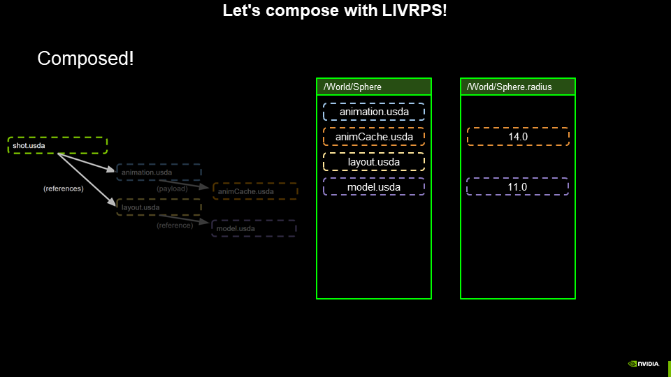

We've finally composed `shot.usda`, and we accomplished our goal of using a Payload to compose the animation opinion and have it as a stronger opinion than the one Referenced by modeling.

A quick sanity check in usdview confirms that our hand-composed
stage yielded the same results as USD.
