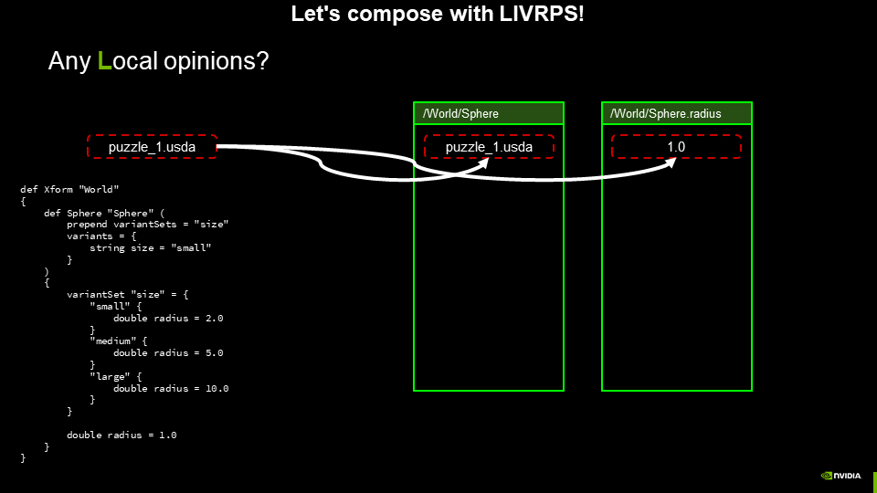
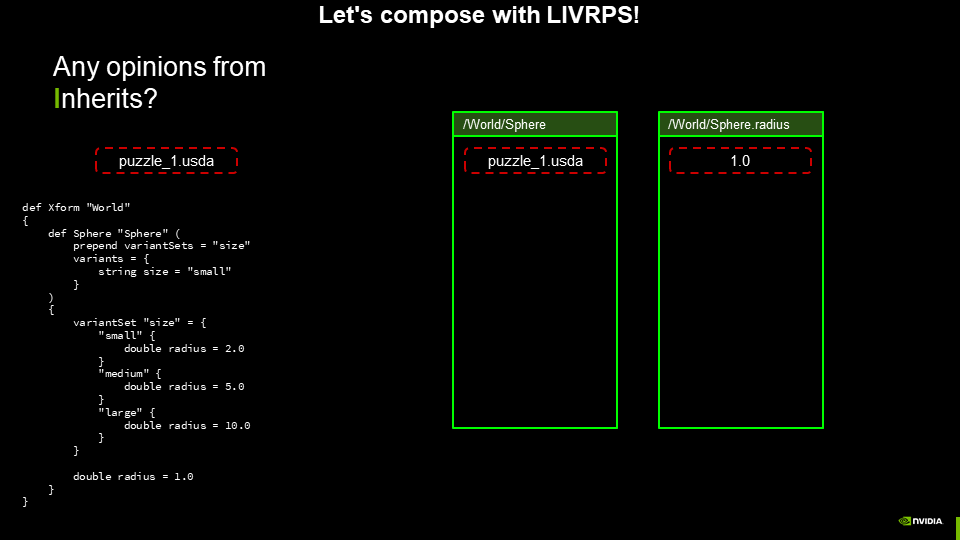
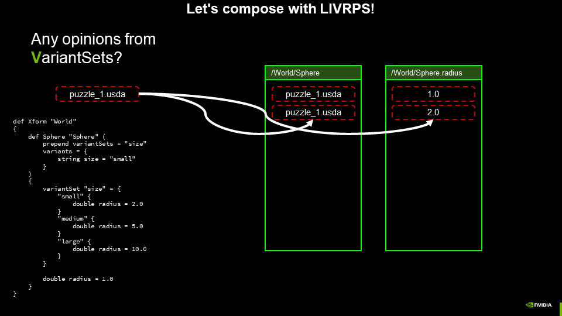
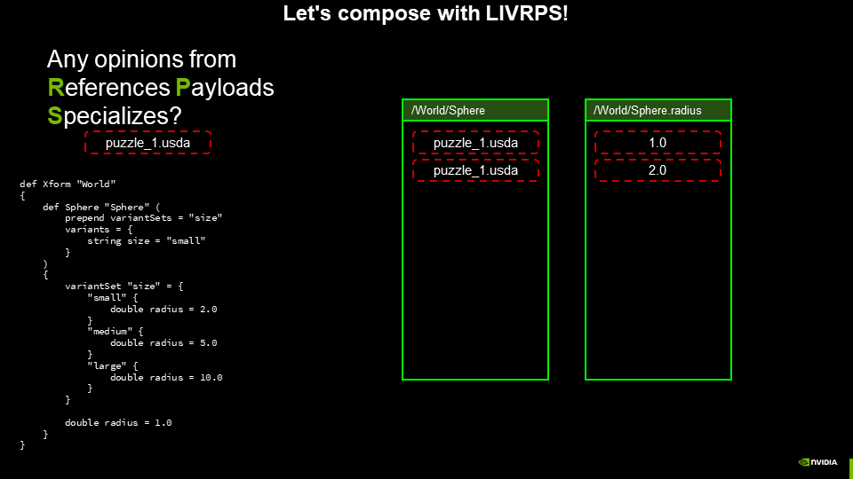
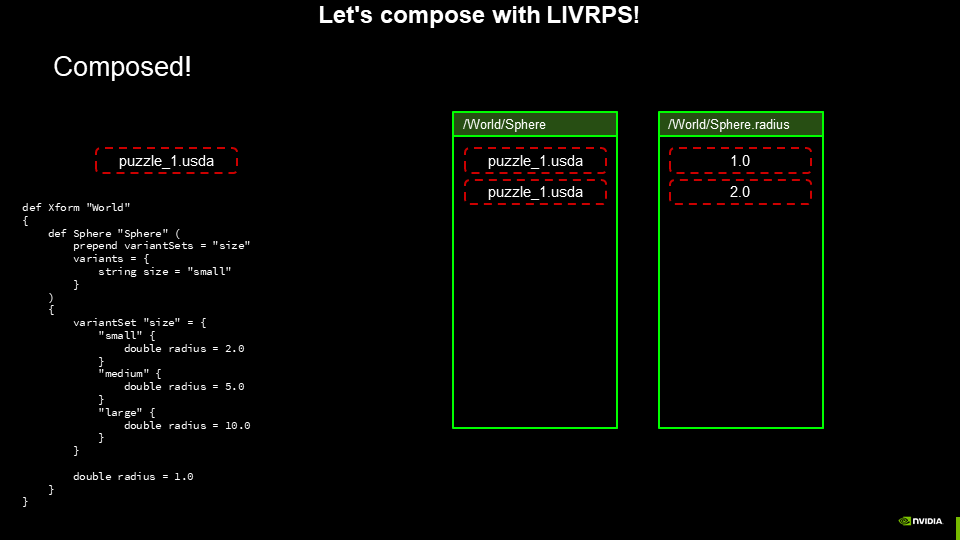

# VariantSet with Local opinion

Here, an Onmiverse user has authored a layer with a direct opinion and a VariantSet on the same prim. He is confused about why the opinion from the VariantSet was not showing up in Create, even though he verified that the "small" variant was selected. Can you spot what's going wrong? Let's evaluate LIVRPS to find out!

There is only a single layer in this LayerStack. So we start by checking for any Local opinions.

There is a Local opinion, so it is added as the strongest opinion in the prim spec and property spec stacks.

Are there any opinions from Inherits? No.

Are there any opinions form VariantSets?

Yes! A VariantSet is contributing an opinion. So that is added
to the prim spec and property spec stacks.

Are there any opinions from References, Payloads, or Specializes?
No, no, and no.

Our stage is composed! Even though this is a layer stack of a single layer, LIVRPS still applies. The fact that the VariantSet data is arranged before the direct opinion on the Sphere prim in the text of the `puzzle_1.usda` file is irrelevant - the only thing that matters is the composition strategy, and within a layer stack, Local opinions are always stronger than opinions authored through a VariantSet.
