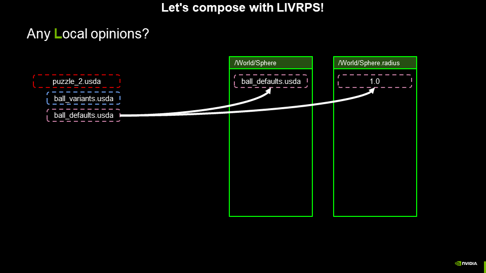
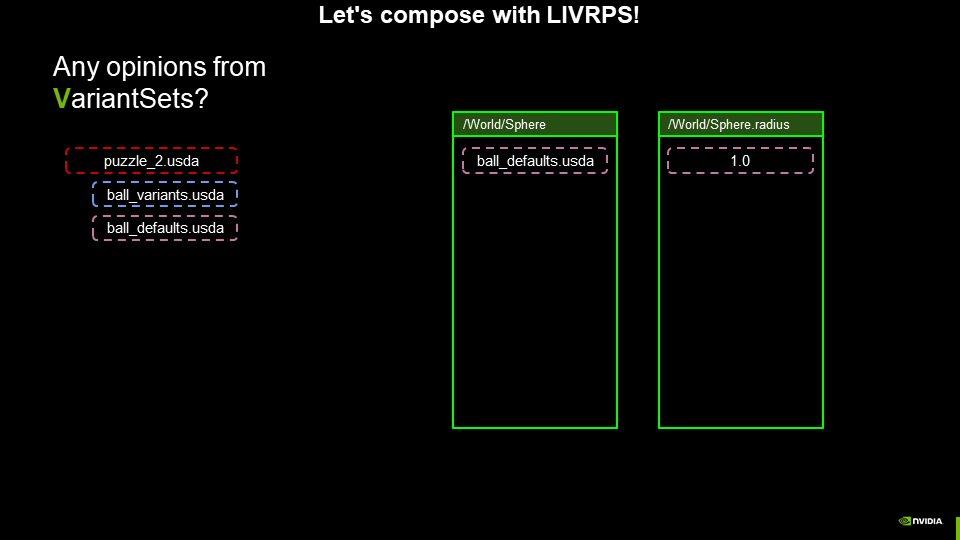
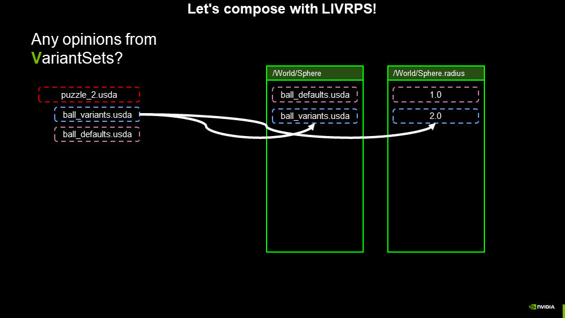
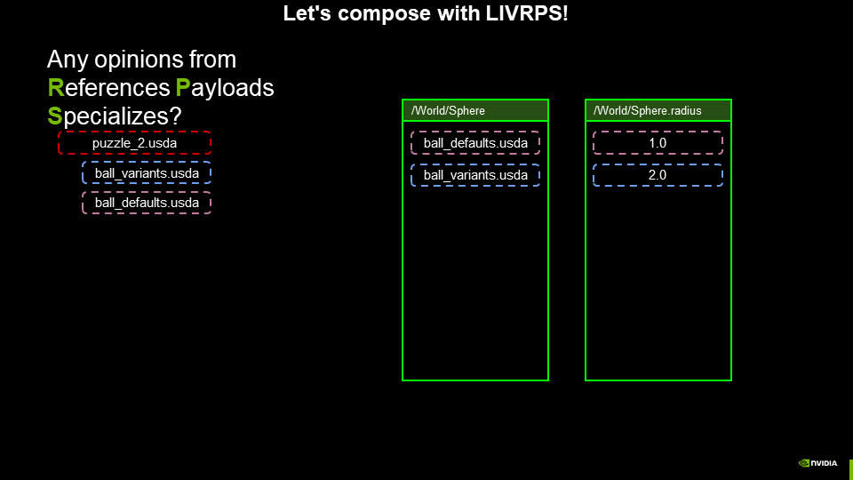
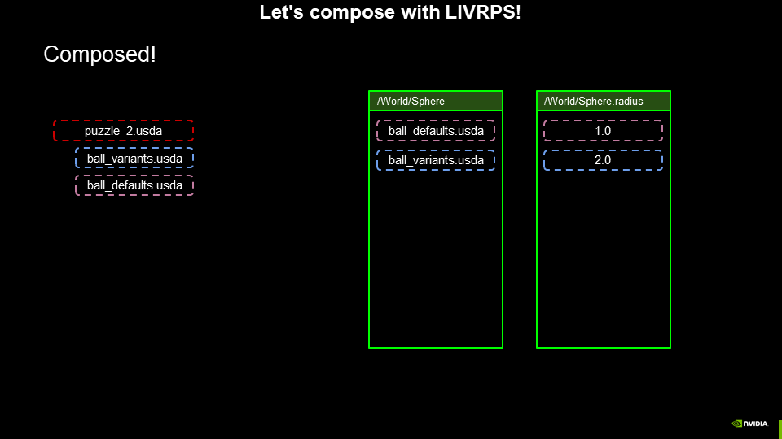

# VariantSet with Local opinion in sublayers

Our Omniverse user wasn't thrilled with the outcome of the previous composition with VariantSet and Local opinion in a single layer,
so he decided to restructure his scene, in hopes of having the opinion in the VariantSet take precedence over the Local opinion.

Now, the primary layer builds the scene using two sublayers. The VariantSet is defined in the stronger sublayer, and the default value is defined in the weaker sublayer. Will this allow the opinion from the VariantSet to take precedence? Let's evaluate LIVRPS and find out.

There are now three layers in our LayerStack. We start by checking for any Local opinions.

There is a Local opinion in this LayerStack, in `ball_defaults.usda`. So that
is composed as the strongest opinion on the prim spec stack and property spec stack.

Remember, LIVRPS operates on the entire LayerStack - a layer and its sublayers. So the Local opinion is still composed as the strongest opinion on the property.

Are there any opinions from Inherits? No.

Are there any opinions form VariantSets? Yes! In the `ball_variants.usda` layer.

The opinion from the VariantSet is composed as the second-strongest
opinion for the prim and property spec stacks.

Are there any opinions from References, Payloads, or Specializes?
No, no, and no.

Our prim and property are composed. Unfortunately, this did not yield the result that the Omniverse user was hoping for. Remember that LIVRPS is applied to an entire LayerStack. Even though the VariantSet and Local default value were split into separate layers, and the _sublayer_ containing the VariantSet was stronger than the _sublayer_ containing the Local default value, the Local default value still takes precedence during composition, because with LIVRPS, Local opinions are stronger than opinions authored through a VariantSet within a LayerStack.