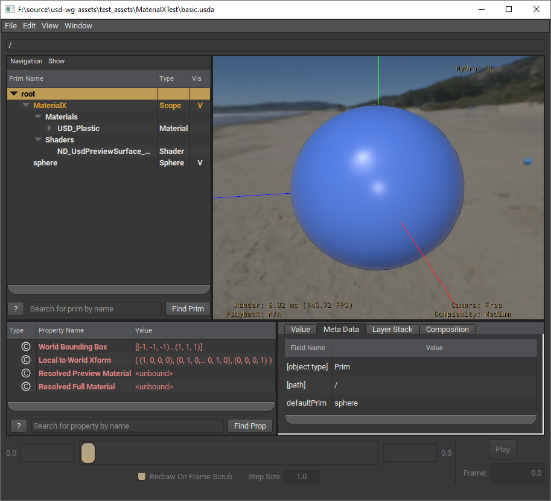
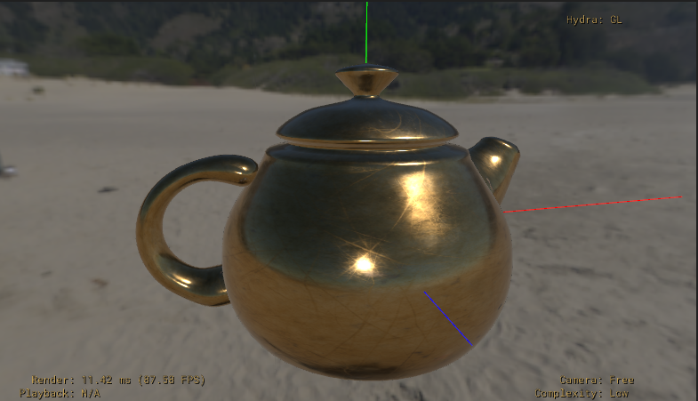
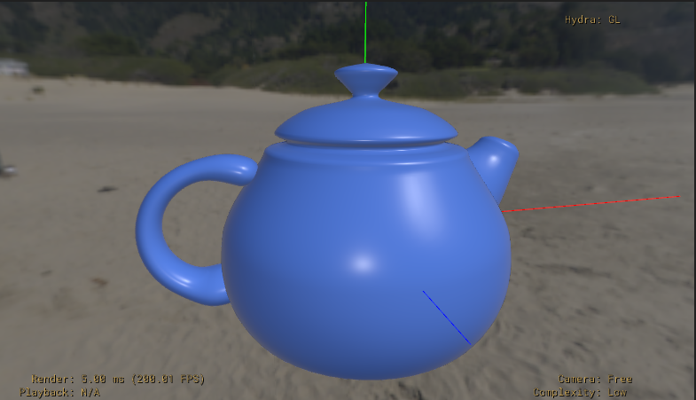

## USD assets with MaterialX

### Enabling MaterialX in USD

To enable materialx, build USD with `--materialx` option

```python build_scripts\build_usd.py  --materialx ```

## Sample USD and MaterialX files

The MaterialX files are TM & (c) 2017 Lucasfilm Entertainment Company Ltd. and Lucasfilm Ltd.

All rights reserved, and covered by the Apache 2.0 license.

**Example 1: Basic**
- basic.usda - Sphere referring a MaterialX usd_preview_surface_plastic.mtlx  

usd_preview_surface_plastic.mtlx defines a material called `USD_Plastic` using the `UsdPreviewSurface` MaterialX node.

- basic_flatten.usda - flattened version of basic.usda 

Flattening can be performed by using `usdcat`
``` 
usdcat --flatten basic.usda -o basic_flatten.usda
```
  

**Example 2: BasicTextured with variants**
- basicTextured.usda - Teapot referring two MaterialX files
    1. usd_preview_surface_plastic.mtlx defines a material called `USD_Plastic` using the `UsdPreviewSurface` MaterialX node.
    2. standard_surface_brass_tiled.mtlx defines a material called `Tiled_Brass` using the `standard_surface` MaterialX node. This MaterialX file also uses a texture for `coat_color` and `coat_rougness` 

 Both of these materials are accessible as `materialvariants`. To switch between variants in USDView, open the Interpreter and run the following commands:
 ``` 
      sbPrim = usdviewApi.stage.GetPrimAtPath("/Teapot")
      vs = sbPrim.GetVariantSet("materialvariants")
      vs.SetVariantSelection("Plastic")
      vs.SetVariantSelection("BrassTiled")
```       
- basicTextured_flatten.usda - flattened version of basicTextured.usda 

  
  

 *Known limitations and MaterialX notes*: 
 - variants are lost when Usd is flattened 
 - Since the `fileprefix="./textures/"` is ignored by usdMtlx, our mtlx duplicates the fileprefix in the value input `value="./textures/`

### References
- MaterialX in USD:  ASWF Open Source 2021 [slides](https://materialx.org/assets/ASWF_OSD2021_MaterialX_slides_final.pdf).
- MaterialX examples: [MaterialX ASWF repository](https://github.com/AcademySoftwareFoundation/MaterialX/tree/main/resources/Materials/Examples).