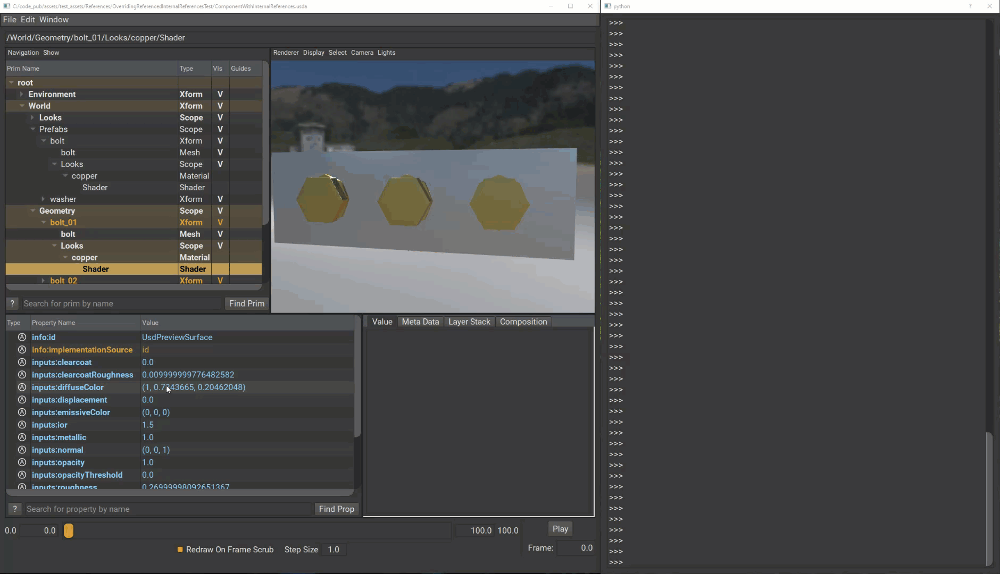
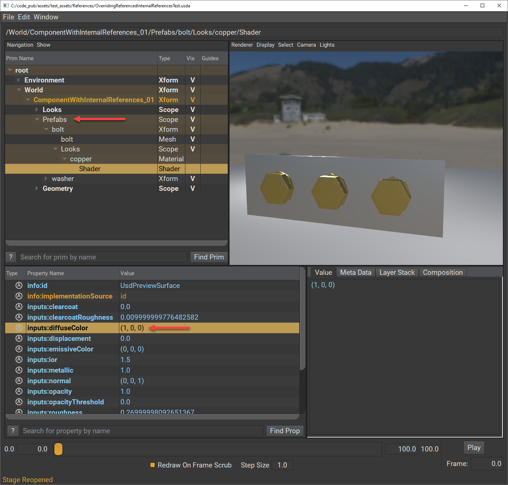
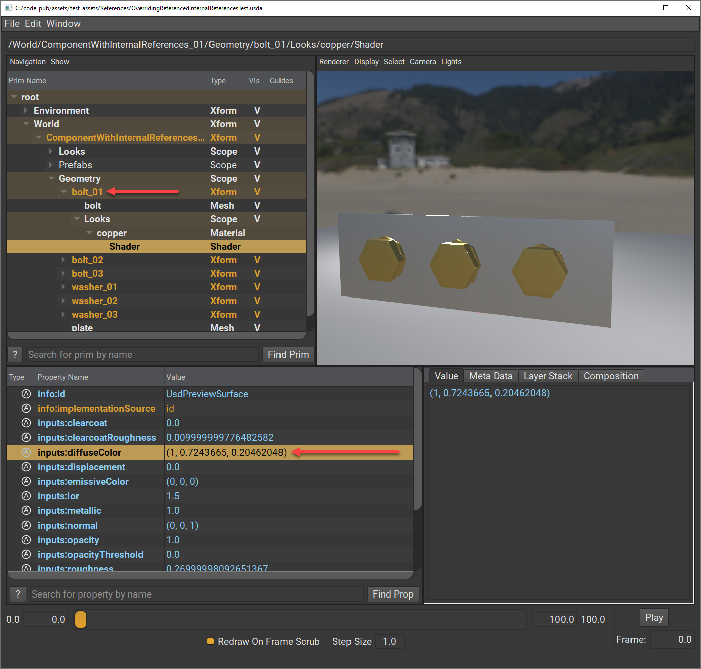

# References Tests

## Overriding Internal References From A Different LayerStack
A common pattern observed from DCCs is to use internal references to represent components or subcomponents while allowing them to keep exports down to one USD layer. Using internal references reduces file size and it is often paired with native instancing for performance benefits as well. Here is an example of what an export of a component model may look like with subcomponents that are internally referenced:

_ComponentWithInternalReferences.usda_ 
```python
#usda 1.0
(
    ...
)

def Xform "World" (
    kind = "component"
)
{
    class Scope "Prefabs"
    {
        def Xform "bolt" (
            kind = "subcomponent"
        )
        {
            ...

            def Mesh "bolt" ( ... ) { ... }
            def Scope "Looks"
            {
                def Material "copper" { ... }
            }
        }

        ...
    }

    def Scope "Geometry"
    {
        def "bolt_01" (prepend references = </World/Prefabs/bolt>) { ... }
        def "bolt_02" (prepend references = </World/Prefabs/bolt>) { ... }
        ...
    }
}
```
This pattern works as intended, but has led to some confusion for end users based on how the internal references behave within the LayerStack they are created or other LayerStacks. The examples below illustrate these differences in behavior.

### Overriding an Internal Reference Target in the Same LayerStack
When you edit or override an internal reference target within the same LayerStack where the internal reference is created, all prims referencing the target will update instantaneously. This produces an interesting "linked" editing experience of multiple assets on the Stage.

You can run this code in `usdview` to simulate that "linked" editing experience. Load `./OverridingReferencedInternalReferencesTest/ComponentWithInternalReferences.usda` on the stage in `usdview` and then run this in the interpreter window:
```python
stage = usdviewApi.stage
# Changing the color of the material in the prototype affects all internal references.
prim = stage.GetPrimAtPath("/World/Prefabs/bolt/Looks/copper/Shader")
color = prim.GetAttribute("inputs:diffuseColor")
color.Set((1.0, 0.0, 0.0))
```
You'll see that the code is editing the `inputs:diffuseColor` of the internal reference target, but all of the prims at reference `</World/Prefabs/bolt>` are updated. The resolved value of the bolt "copies" change to `(1, 0 ,0)`.


### Overriding an Internal Reference Target from a Different LayerStack
When you create an external reference of the asset containing the internal references (e.g. a component model referenced into an assembly model), the "links" are hardened to behave like traditional external references losing the "linked" editing experience.

Here is an example of an assembly model that references the previous component model. In this new LayerStack, we attempt to change the color of the bolt "prefab" wanting to broadcast the change to all the prims that reference it.
_OverridingReferenceInternalReferencesTest.usda_ 
```python
#usda 1.0
(
    ...
)

def Xform "World" (
    kind = "assembly"
)
{
    def "ComponentWithInternalReferences_01" (
        prepend references = @./OverridingReferencedInternalReferencesTest/ComponentWithInternalReferences.usda@
    )
    {
        over "Prefabs"
        {
            over "bolt"
            {
                over "Looks"
                {
                    over "copper"
                    {
                        over "Shader"
                        {
                            color3f inputs:diffuseColor = (1, 0, 0) (
                                hidden = false
                                renderType = "color"
                            )
                        }
                    }
                }
            }
        }
    }
}
```
When you load `./OverridingReferencedInternalReferencesTest.usda` on the stage, you can see that the override is applied and correctly resolved on the "prefab".

But the prims that are internally referencing that target, show that their resolved value has not changed.


## License

These assets are provided under the [Apache 2.0](../../LICENSE) license.