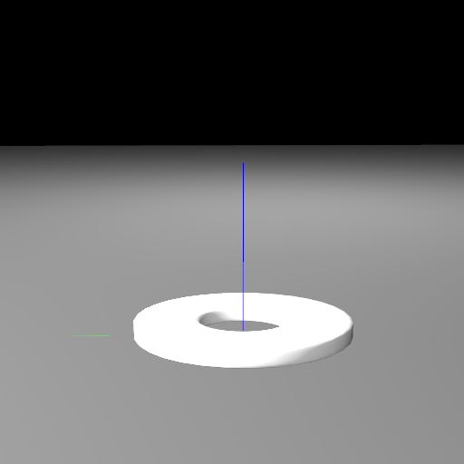
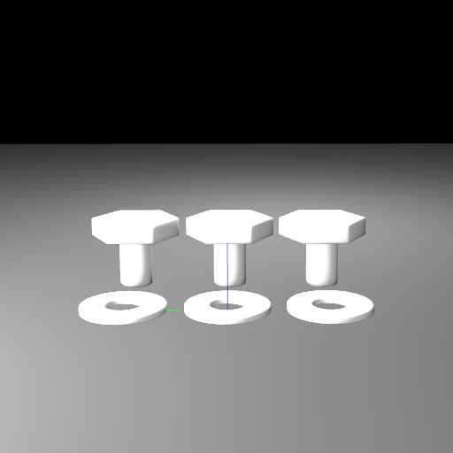
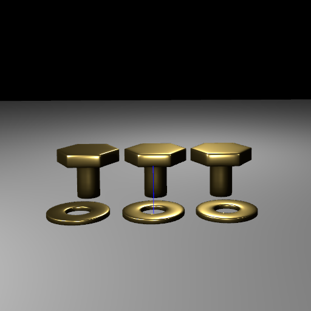
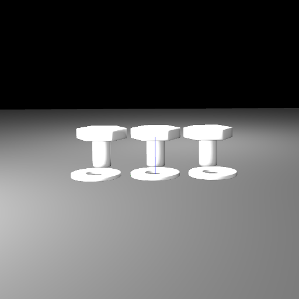
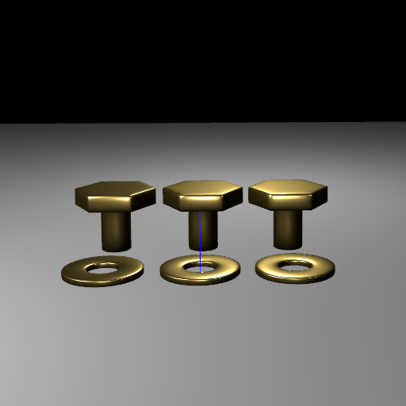
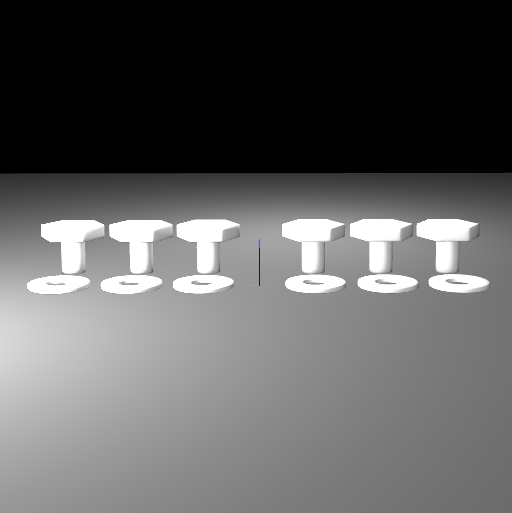
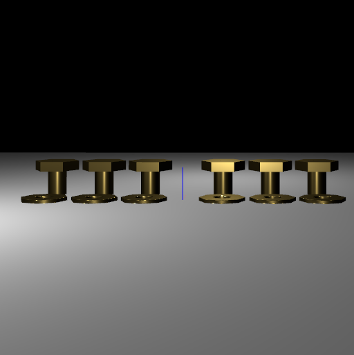

# Unencapsulated Relationship Tests

> **NOTE**: This contains tests that show behavior changes introduced in newer versions of USD.

These tests focus on demonstrating valid and invalid uses of unencapsulated relationship targets. A relationship target is unencapsulated when the target prim path is outside of the scope of a reference target prim and its descendants. When these sorts of relationships are referenced, the composition engine is unable to resolve and update the prim path of the relationship target because the target no longer exists in the new context. This can happen due to:
1. Bad asset structure with relationships target prims outside of the default prim.
2. Misuse of a reference by targeting a prim that wasn't designed or intended to be a reference target.

When you add a reference with an unencapsulated relationship, you will see an error like this in the console:
```
Warning (secondary thread): in _ReportErrors at line 3157 of W:\257786efc4f464db\USD\pxr\usd\usd\stage.cpp -- In </World/washer.material:binding>: The relationship target </World/Looks/metal> from </World/Geometry/washer.material:binding> in layer @c:/code_pub/assets/test_assets/RelationshipEncapsulationTests/ExternalReferenceBadTargetTest/washer.usda@ refers to a path outside the scope of the reference from </World/washer>.  Ignoring. (getting targets for relationship </World/washer.material:binding> on stage @c:/code_pub/assets/test_assets/RelationshipEncapsulationTests/ExternalReferenceBadTargetTest.usda@ <0000027BA0602B10>)
```
These tests all use the `material:binding` relationship for demonstration since it is a very common property in OpenUSD and often where the illustrated issues will be found, but this applies to all relationships. An added benefit of using material bindings for these tests is that we can visually validate the issue because any unencapsulated binding targets will be discarded and the renderer will show the mesh with no material.

## External reference with a bad target prim (ExternalReferenceBadTargetTest)
The `ExternalReferenceBadTargetTest.usda` stage references a `washer.usda` component asset with a valid asset structure. It defines a default prim, `World`, so that when this layer is referenced using the default prim, it properly brings along its geometry and materials. This test illustrates an issue where an end-user of the asset decided to only reference a specific mesh from the asset and causes a broken relationship for the bound material on the mesh since the material is not referenced.

_washer.usda_ 
```python
#usda 1.0
(
    defaultPrim = "World"
    metersPerUnit = 0.01
    upAxis = "Z"
)

def Xform "World" (
    kind = "component"
)
{
    def Scope "Looks"
    {
        def Material "metal" { ... }
    }

    def Scope "Geometry"
    {
        def Mesh "washer" (
            active = true
            prepend apiSchemas = ["MaterialBindingAPI"]
        )
        {
            # Relationship to a properly encapsulated prim.
            rel material:binding = </World/Looks/metal> (
                bindMaterialAs = "weakerThanDescendants"
            )
            ...
        }
    }
}
```

_Stage_ 
```python
#usda 1.0
(
    defaultPrim = "World"
    metersPerUnit = 0.01
    upAxis = "Z"
)

def Xform "World"
{
    def "washer" (
        # Only references the mesh and leaves out the material
        # causing an unencapsulated relationship as the material:binding
        # now points to a prim outside of the referenced hierarchy.
        prepend references = @./ExternalReferenceBadTargetTest/washer.usda@</World/Geometry/washer>
    )
    {

    }
}
```

### Result: (Invalid)



__Example Console Output__ 
```
Warning (secondary thread): in _ReportErrors at line 3157 of W:\257786efc4f464db\USD\pxr\usd\usd\stage.cpp -- In </World/washer.material:binding>: The relationship target </World/Looks/metal> from </World/Geometry/washer.material:binding> in layer @c:/code_pub/assets/test_assets/RelationshipEncapsulationTests/ExternalReferenceBadTargetTest/washer.usda@ refers to a path outside the scope of the reference from </World/washer>.  Ignoring. (getting targets for relationship </World/washer.material:binding> on stage @c:/code_pub/assets/test_assets/RelationshipEncapsulationTests/ExternalReferenceBadTargetTest.usda@ <0000027BA0602B10>)
```

## Internal reference with unencapsulated material binding (InternalReferenceTest)
> **NOTE**: This test shows behavior changes introduced in newer versions of USD (23.05+).

The `InternalReferenceTest.usda` stage is an assembly asset with some prototype component assets defined inline. These prototype assets are then used as internal references and potentially natively instanced as a workflow and performance optimization. This is a useful technique for DCCs that may want to export an assembly asset as a single layer, but still identify component assets within the assembly say a car from a CAD application with fully modeled hardware that is repeated many times with the car asset.

This can get tricky when a developer wants to share one material across multiple component assets (e.g. a copper metal material shared between bolts and washers). One valid, but tedious approach is to bind the shared material after the prototypes have been referenced within the assembly. 

```python
#usda 1.0
(
    defaultPrim = "World"
    metersPerUnit = 0.01
    upAxis = "Z"
)

class Scope "Prototypes"
{
    def Xform "bolt" (kind = "component") { ... }
}

def Xform "World" (kind = "assembly")
{
    def Scope "Looks"
    {
        def Material "metal" { ... }
    }

    def "bolt_01" (prepend references = </Prototypes/bolt>)
    {
        def Mesh "bolt" (
            prepend apiSchemas = ["MaterialBindingAPI"]
        )
        {
            rel material:binding = </World/Looks/metal> (
                bindMaterialAs = "weakerThanDescendants"
            )
        }
    }
    def "bolt_02" (prepend references = </Prototypes/bolt>)
    {
        def Mesh "bolt" (
            prepend apiSchemas = ["MaterialBindingAPI"]
        )
        {
            rel material:binding = </World/Looks/metal> (
                bindMaterialAs = "weakerThanDescendants"
            )
        }
    }
}
```
Another approach would be to create an unencapsulated relationship for the material bindings where the component assets are defined.
```python
#usda 1.0
(
    defaultPrim = "World"
    metersPerUnit = 0.01
    upAxis = "Z"
)

class Scope "Prototypes"
{
    def Xform "bolt" (kind = "component")
    {
        def Mesh "bolt" (
            prepend apiSchemas = ["MaterialBindingAPI"]
        )
        {
            # This relationship is reaching outside of the
            # component model encapsulation.
            rel material:binding = </World/Looks/metal> (
                bindMaterialAs = "weakerThanDescendants"
            )
            ...
        }
    }
}

def Xform "World" (
    kind = "assembly"
)
{
    def Scope "Looks"
    {
        def Material "metal" { ... }
    }

    def "bolt_01" (prepend references = </Prototypes/bolt>) { ... }

    def "bolt_02" (prepend references = </Prototypes/bolt>) { ... }
}
```

This is bad, right? Well, as of [USD 23.05 unencapsulated relationships are allowed for internal references](https://github.com/PixarAnimationStudios/OpenUSD/commit/13fa79d1a6dde7c3eaa88378ec7233870c080b34). In this test, we will show the expected results for USD version before 23.05 and 23.05+.

### Result: (Invalid in <23.05)



__Example Console Output__
```
Warning (secondary thread): in _ReportErrors at line 2874 of W:\e7f6a7475fd8ed53\USD\pxr\usd\usd\stage.cpp -- In </World/bolt_02/bolt.material:binding>: The relationship target </World/Looks/metal> from </Prototypes/bolt/bolt.material:binding> in layer @c:/code_pub/assets/test_assets/RelationshipEncapsulationTests/InternalReferenceTest.usda@ refers to a path outside the scope of the reference from </World/bolt_02>.  Ignoring. (getting targets for relationship </World/bolt_02/bolt.material:binding> on stage @c:/code_pub/assets/test_assets/RelationshipEncapsulationTests/InternalReferenceTest.usda@ <000001C7DC011F70>)
```

### Result: (Valid in 23.05+)



## Internal reference with unencapsulated material bindings across sublayers (SublayeredInternalReferenceTest)
> **NOTE**: This test shows behavior changes introduced in newer versions of USD (23.05+).

This is similar to the [regular internal reference example](#internal-reference-with-unencapsulated-material-binding-internalreferencetest), but extends the example to utilize sublayers to show that the unencapsulated material binding in an internal reference is respected for the whole LayerStack as of 23.05. The example shows an assembly where the developer wanted to separate the modeling and shading work into sublayers. The component model prototypes and the assembly layout are defined in a `*.modeling.usda` sublayer and a shared material is created and bound to the prototypes in a `*.shading.usda` sublayer.

### Result: (Invalid in <23.05)



__Example Console Output__ 
```
Warning (secondary thread): in _ReportErrors at line 2874 of W:\e7f6a7475fd8ed53\USD\pxr\usd\usd\stage.cpp -- In </World/bolt_02/bolt.material:binding>: The relationship target </World/Looks/metal> from </Prototypes/bolt/bolt.material:binding> in layer @c:/code_pub/assets/test_assets/RelationshipEncapsulationTests/SublayeredInternalReferenceTest/hardware.shading.usda@ refers to a path outside the scope of the reference from </World/bolt_02>.  Ignoring. (getting targets for relationship </World/bolt_02/bolt.material:binding> on stage @c:/code_pub/assets/test_assets/RelationshipEncapsulationTests/SublayeredInternalReferenceTest.usda@ <00000289F3B12090>)
```
### Result: (Valid in 23.05+)



## Referenced assemblies with unencapsulated internal references (ReferencedAssembliesWithInternalReferencesTest)
This builds from the [regular internal reference example](#internal-reference-with-unencapsulated-material-binding-internalreferencetest), but asks the question, "What happens if the prototypes are defined outside of the `defaultPrim`? Do the internal references to the prototypes break when the assembly is externally referenced?" This is not a question of unencapsulated relationships, but unencapsulated internal references.

_InteralReferenceEncapsulatedPrototypes.usda_
```python
#usda 1.0
(
    defaultPrim = "World"
    metersPerUnit = 0.01
    upAxis = "Z"
)
def Xform "World" (
    kind = "assembly"
)
{
    def Scope "Looks"
    {
        def Material "metal" { ... }
    }

    # References prototype underneath the defaultPrim
    def "bolt_01" (prepend references = </World/Prototypes/bolt>) { ... }
    def "bolt_02" (prepend references = </World/Prototypes/bolt>) { ... }

    class Scope "Prototypes"
    {
        def Xform "bolt" (kind = "component") { ... }        
    }
}
```

_InteralReferenceUnencapsulatedPrototypes.usda_
```python
#usda 1.0
(
    defaultPrim = "World"
    metersPerUnit = 0.01
    upAxis = "Z"
)
def Xform "World" (
    kind = "assembly"
)
{
    def Scope "Looks"
    {
        def Material "metal" { ... }
    }

    # References prototype outside of the defaultPrim
    def "bolt_01" (prepend references = </Prototypes/bolt>) { ... }
    def "bolt_02" (prepend references = </Prototypes/bolt>) { ... }
}
class Scope "Prototypes"
{
    def Xform "bolt" (kind = "component") { ... }        
}
```

### Result: (Valid in <23.05)
As expected, the unencapsulated material binding in the internal references will not work in USD versions older than 23.05, but the unencapsulated internal references (i.e. referencing a prototype prim outside of the default prim) did not break, so this case is marked `Valid`.



### Result: (Valid in 23.05+)



## License

These assets are provided under the [Apache 2.0](../../LICENSE) license.