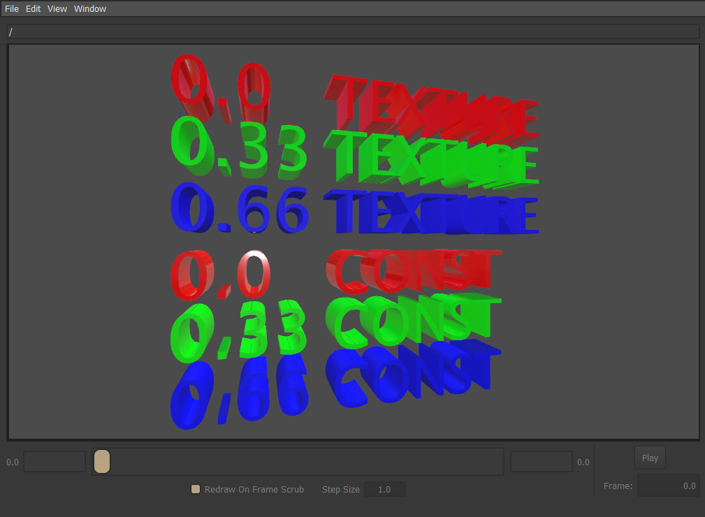
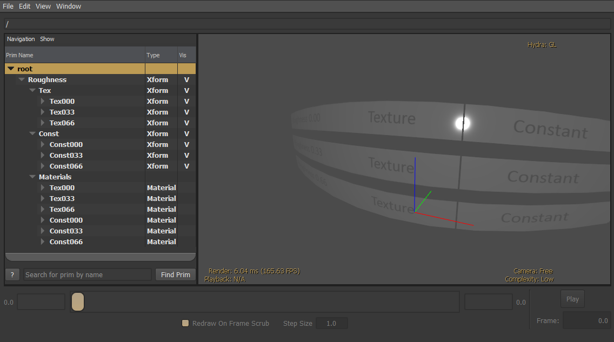
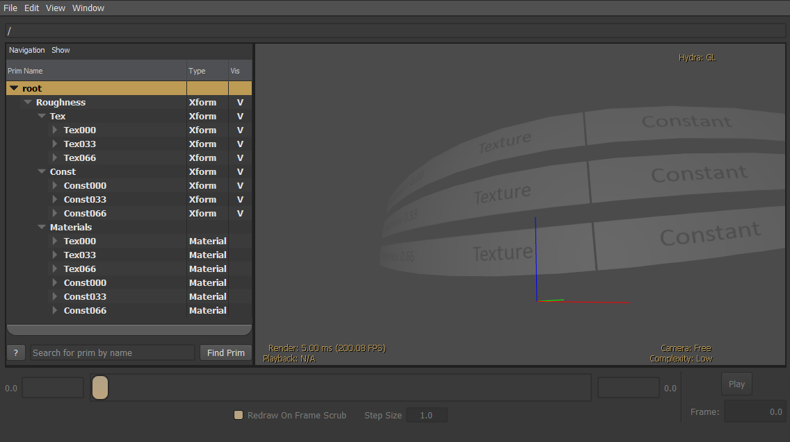

# Roughness Material Constant vs Texture Test

## Screenshot

  

## Description

This file contains six meshes, the left three specify roughness values of 0.0, 0.33, and 0.66 specified via a texture.
The right three meshes similarly specify roughness, however the value is authored as a constant on the UsdPreviewSurface material.

Specification: https://graphics.pixar.com/usd/release/spec_usdpreviewsurface.html#roughness-vs-glossiness

The meshes are aligned intentionally to make it easy to compare lighting between the textured and constant versions. The intended
use for debugging is to catch a light highlight directly on the split between meshes to enable easy visual inspection of the 
lighting response (see below).

  
  
  

The roughness values are packed into a single texture, with the red channel set to 0.00, the green channel set to 0.33, and the
blue channel is set to 0.66.

Note: that in the screenshots above, usdview is rendering the mesh as semi-transparent, which is incorrect.

Created on contract by [Nika Somkhishvili](https://www.fiverr.com/nikasomkhishvil).

## License Information

  
To the extent possible under law, Unity has waived all copyright and related or neighboring rights to this asset.  

