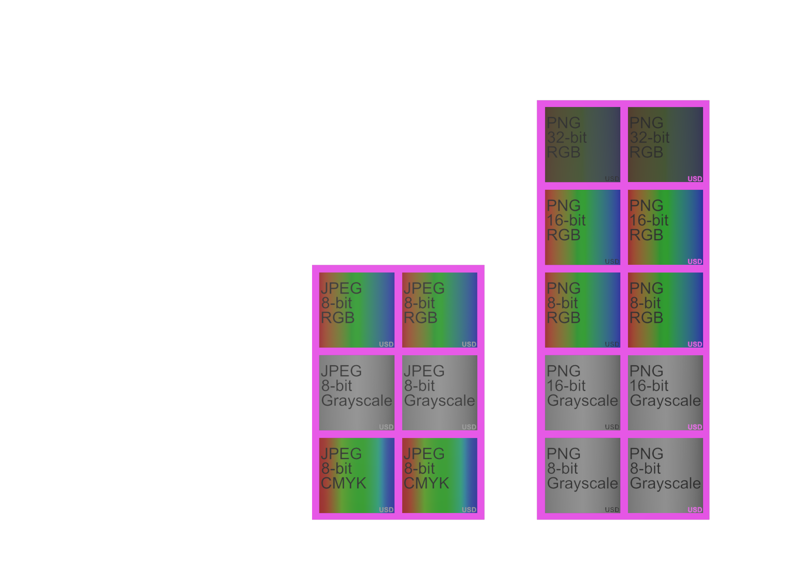
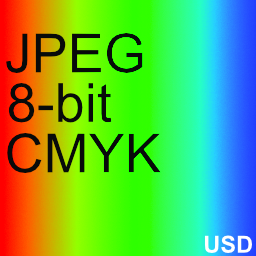
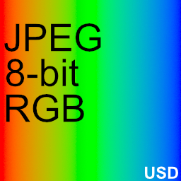
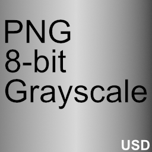
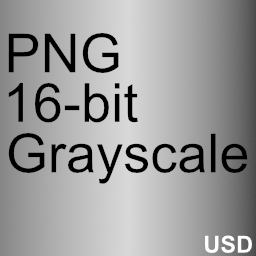
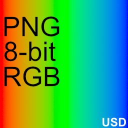
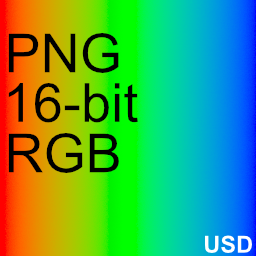
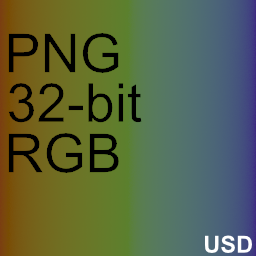

# Texture File Format Tests

This set of assets is intended to test support for loading and rendering basic texture file formats.

## Screenshot

  
_usdrecord 24.03_

## File formats

| File format | Configuration | Texture |
| --- | --- | --- |
| JPEG | CMYK, 8-bit |  |
| JPEG | RGB, 8-bit |  |
| JPEG | Grayscale, 8-bit |  |
| PNG | Grayscale 8-bit |  |
| PNG | Frayscale, 16-bit |  |
| PNG | RGB, 8-bit |  |
| PNG | RGB, 16-bit |  |
| PNG | RGB, 32-bit | |