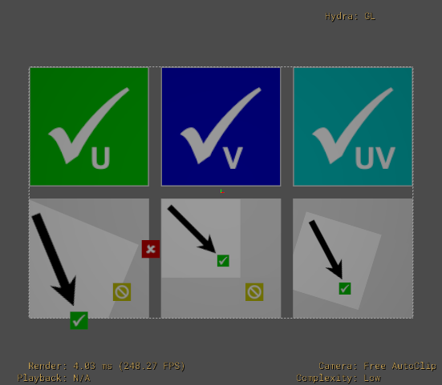
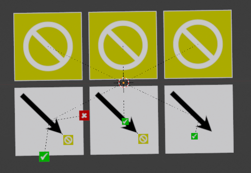
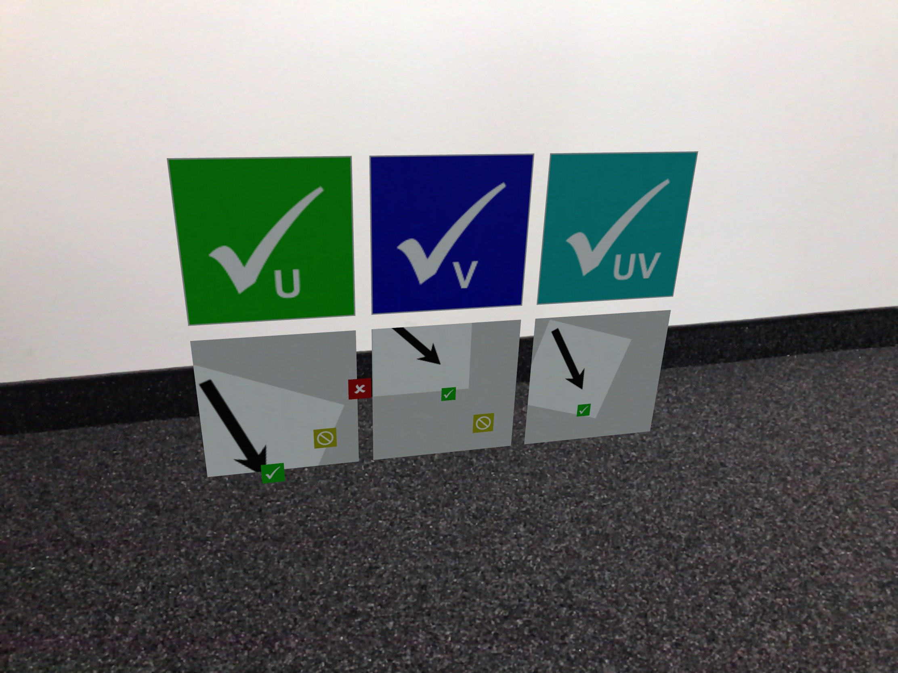

# Texture Transform Test

## Screenshot

  
_usdview 21-05_

## Description

This model tests `UsdTransform2d` texture transform capabilities.  

It's a conversion from the glTF test asset with the same name found here: https://github.com/KhronosGroup/glTF-Sample-Models/blob/master/2.0/TextureTransformTest/README.md.

Specification: https://graphics.pixar.com/usd/release/spec_usdpreviewsurface.html#transform2d

  
_glTF reference_

## Problem: UsdTransform2d not supported

   
 _Blender 3.1_

## Problem: Incorrect order of operations

The specification states that the order of operations is always defined as
> _result = in * scale * rotate * translation_  

A different interpretation will lead to incorrect results.  

   
 _QuickLook on iOS 15.6_

## License Information
This conversion bears the same license as the [source asset](https://github.com/KhronosGroup/glTF-Sample-Models/blob/master/2.0/TextureTransformTest/README.md).  

  
To the extent possible under law, Microsoft has waived all copyright and related or neighboring rights to this asset.  

Conversion by Felix Herbst / prefrontal cortex