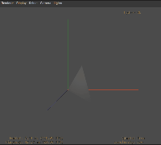
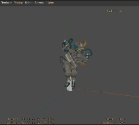
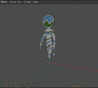
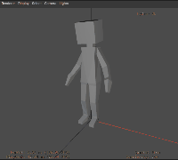
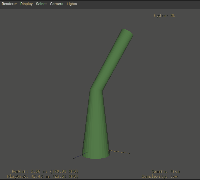

# Test Asset Docs

## Convert from glTF 2.0 -> usdz

### Goal

Given the repo [here](https://github.com/KhronosGroup/glTF-Sample-Models) generate equivalent usdz files for each asset, with a focus on animations

### Process
1. Pulled down the [glTF-Sample-Models](https://github.com/KhronosGroup/glTF-Sample-Models) repository
2. Downloaded [Reality Converter](https://developer.apple.com/news/?id=01132020a)
3. For Each asset, drag and drop the asset folder into Reality Converter
4. If the asset loads properly, export it back out of Reality Converter to generate .usdz
5. Commit .usdz file
6. Pull branch on PC to run [USDView](https://graphics.pixar.com/usd/release/toolset.html#usdview) from [Omniverse Launcher](https://www.nvidia.com/en-us/omniverse/download/)
7. Using [ScreenToGif](https://www.screentogif.com) record the animation in USDView
8. Save new screenshot and update this doc.

**Note: For all failed projects, `usdchecker` will be run to debug further**

### Animated Assets

| Name                                  | Sample from usdview                                                                | glTF 2.0 Link                                                                               |  
|-----------------------                |-----------                                                                                     |-------------------------------                                                            |
| [Animated Cube](../AnimatedCube/)                             |  |  [glTF 2.0 Link ](https://github.com/KhronosGroup/glTF-Sample-Models/tree/master/2.0/AnimatedCube)   |  Yes                |
| [Animated Triangle](../AnimatedTriangle/)                     | |[glTF 2.0 Link ](https://github.com/KhronosGroup/glTF-Sample-Models/tree/master/2.0/AnimatedTriangle)| 
| [BoxAnimated](../BoxAnimated/)                                ||[glTF 2.0 Link ](https://github.com/KhronosGroup/glTF-Sample-Models/tree/master/2.0/BoxAnimated)|
| [BrainStem](../BrainStem/)                                    ||[glTF 2.0 Link ](https://github.com/KhronosGroup/glTF-Sample-Models/tree/master/2.0/BrainStem)|
| [Cesium Man](../CesiumMan/)                                   || [glTF 2.0 Link ](https://github.com/KhronosGroup/glTF-Sample-Models/tree/master/2.0/CesiumMan)|
| [Interpolation Test](../InterpolationTest/)                   || [glTF 2.0 Link ](https://github.com/KhronosGroup/glTF-Sample-Models/tree/master/2.0/InterpolationTest)|
| [Rigged Figure](../RiggedFigure/)                             || [glTF 2.0 Link ](https://github.com/KhronosGroup/glTF-Sample-Models/tree/master/2.0/RiggedFigure)|  Yes      |  
| [Rigged Simple](../RiggedSimple/)                             ||[glTF 2.0 Link ](https://github.com/KhronosGroup/glTF-Sample-Models/tree/master/2.0/RiggedSimple)|
 
