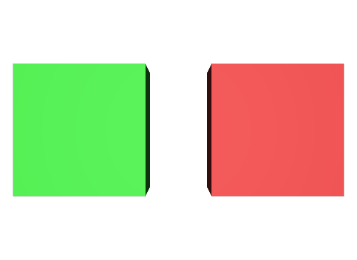
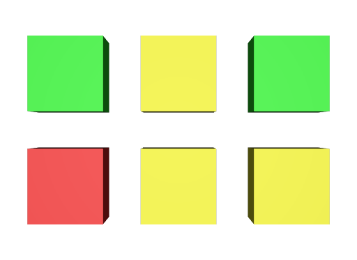

# Stage Composition

These assets show and test how compositon arcs and related concepts work.

## Payload

[payload](./payload/) contains assets to test payloading files and prims.

## Reference

[reference](./reference/) contains assets to test referencing files and prims.

## SubLayer

[subLayer](./subLayer/) contains assets to test sublayering files.

## Active

[active.usda](./active.usda) shows an example of the `active` prim metadata. One inactive (`active = false`), red cube and one active (`active = true`), green cube exist in the stage.

_active.usda, usdrecord 22.08_

## Classes

[class_inherit.usda](./class_inherit.usda) shows how to use a `class` and what effect overriding a class attribute has in an inheriting prim.

_class\_inherit.usda, usdrecord 22.08_

## Inherit and Specialize

[inherit_and_specialize.usda](./inherit_and_specialize.usda) shows the difference between `inherits` and `specializes`.

_inherit\_and\_specialize.usda, usdrecord 22.08_

## Over

[over.usda](./over.usda) shows the difference between `over`s and `def`s.

_over.usda, usdrecord 22.08_

## Purpose

[purpose.usda](./purpose.usda) shows an example of the `purpose` prim attribute. There are four cubes with different `purpose` tokens set:

- `CubeIsGuide` with `token purpose = "guide"`, colored red
- `CubeIsRender` with `token purpose = "render"`, colored green
- `CubeIsProxy` with `token purpose = "proxy"`, colored blue
- `CubeIsOther` with `token purpose = "other"`, colored yellow

_purpose.usda, usdrecord 22.08_
