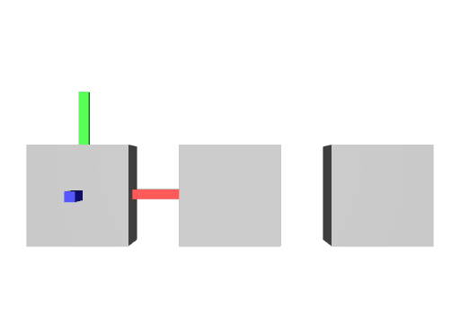

# MetersPerUnit

These files show how the `metersPerUnit` stage metadata works.

## MetersPerUnit = 1

[metersPerUnit_1.usda](./metersPerUnit_1.usda)

```usda
metersPerUnit = 1
```


_metersPerUnit_1.usda, usdrecord 22.08_

## MetersPerUnit = 10

[metersPerUnit_10.usda](./metersPerUnit_10.usda)

```usda
metersPerUnit = 10
```


_metersPerUnit_10.usda, usdrecord 22.08_

## MetersPerUnit mixed

[metersPerUnit_mix.usda](./metersPerUnit_mixed.usda)

This stage sets `metersPerUnit = 100` and also sublayers `metersPerUnit_1.usda` and `metersPerUnit_10.usda` with different values.

USD does not auto-scale layers with divergent `metersPerUnit`. As a result, all three cubes in this file have the same size.


_metersPerUnit_mix.usda, usdrecord 22.08_
