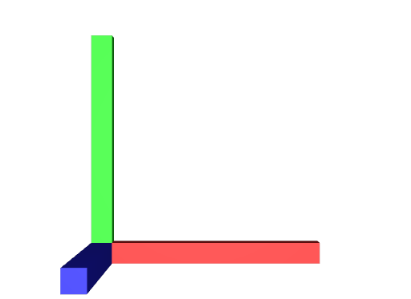
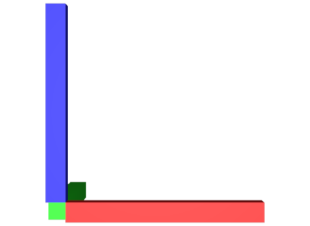

# UpAxis

These files show examples of the three valid `upAxis` values and one invalid value.

## X

[upAxis_X.usda](./upAxis_X.usda)

```usda
upAxis = "X"
```


_upAxis="X" usdrecord 22.08_

## Y

[upAxis_Y.usda](./upAxis_Y.usda)

```usda
upAxis = "Y"
```


_upAxis="Y" usdrecord 22.08_

## Z

[upAxis_Z.usda](./upAxis_Z.usda)

```usda
upAxis = "Z"
```


_upAxis="Z" usdrecord 22.08_

## Invalid

[upAxis_invalid.usda](./upAxis_invalid.usda)

```usda
upAxis = "invalid"
```


_upAxis="invalid" usdrecord 22.08_
