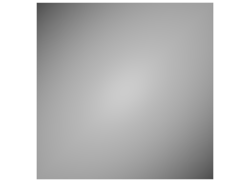
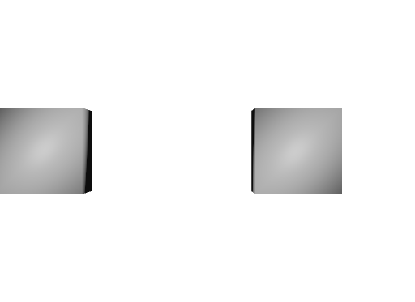

# Extent

These files showcase a regular mesh `extent` and the behavior of other `extent` values.

All meshes are the same cube mesh with vertices positioned at `[-0.5 .. 0.5]` on all three axis.

Schema specification: <https://github.com/PixarAnimationStudios/USD/blob/release/pxr/usd/usdGeom/schema.usda>

## Regular Extent

[regular_extent.usda](./regular_extent.usda)

Regular extent exactly matching the cube dimensions.

```usda
float3[] extent = [(-0.5, -0.5, -0.5), (0.5, 0.5, 0.5)]
```


_regular_extent.usda, usdrecord 22.08_

## Inverse Extent

[inverse_extent.usda](./inverse_extent.usda)

This mesh has its extent values in the wrong order:

```usda
float3[] extent = [(1,1,1), (0,0,0)]
```


_inverse_extent.usda, usdrecord 22.08_

This screenshot is empty as expected.

## No Extent

[no_extent.usda](./no_extent.usda)

This mesh has no extent.


_no_extent.usda, usdrecord 22.08_

## Scaled Extent

[scaled_extent.usda](./scaled_extent.usda)

These two meshes have scaled extents.

Extent too small:

```usda
float3[] extent = [(-0.1, -0.1, -0.1), (0.1, 0.1, 0.1)]
```

Extent too big:

```usda
float3[] extent = [(-1, -1, -1), (1, 1, 1)]
```


_scaled_extent.usda, usdrecord 22.08_

## Zero Extent

[zero_extent.usda](./zero_extent.usda)

This mesh has its extent set to zero.

```usda
float3[] extent = [(0,0,0), (0,0,0)]
```


_zero_extent.usda, usdrecord 22.08_

This screenshot is empty as expected.
