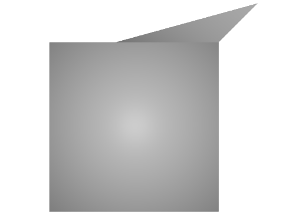

# 5 Face

## Screenshot


_usdrecord 22.08_

## Description

This is a mesh with one of the `faceVertexCounts` set to `5`.

```usda
int[] faceVertexCounts = [4, 4, 4, 4, 4, 5]
```

Schema specification: <https://github.com/PixarAnimationStudios/USD/blob/release/pxr/usd/usdGeom/schema.usda>
