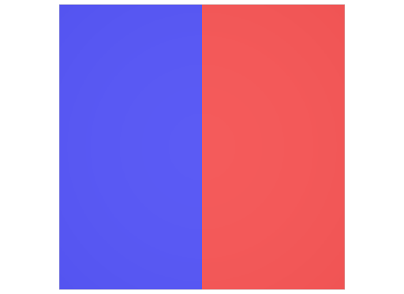

# Double Sided Mesh

## Screenshot

_usdrecord 22.08_

## Description

These are two double sided meshes with `doubleSided = 1`. The same example is available with single sided meshes at [singleSided](../singleSided).

Schema specification: <https://github.com/PixarAnimationStudios/USD/blob/release/pxr/usd/usdGeom/schema.usda>
