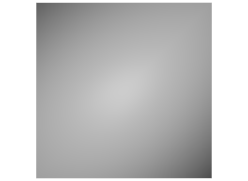

# Mixed FaceVertexCounts

## Screenshot


_usdrecord 22.08_

## Description

This cube mesh uses a mix of different `faceVertexCounts`:

```usda
int[] faceVertexCounts = [4, 3, 3, ...]
```

Regular meshes can be found for at [quads](../quad_mesh/) and [triangles](../triangled_mesh/).

Schema specification: <https://github.com/PixarAnimationStudios/USD/blob/release/pxr/usd/usdGeom/schema.usda>
