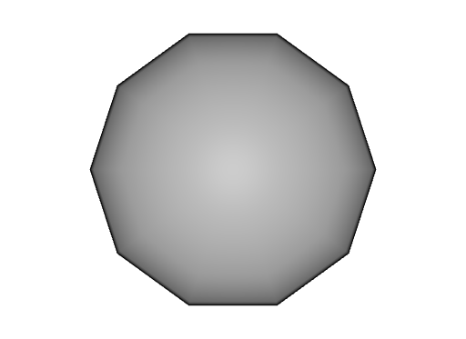
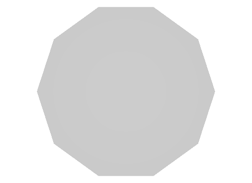
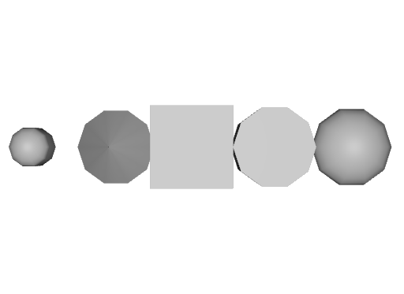

# Primitives

These files show all available mesh primitives.

Schema specification: <https://github.com/PixarAnimationStudios/USD/blob/release/pxr/usd/usdGeom/schema.usda>

## Capsule

[capsule.usda](./capsule.usda)

This file shows an example of the `Capsule` primitive.

_capsule.usda, usdrecord 22.08_

## Cone

[cone.usda](./cone.usda)

This file shows an example of the `Cone` primitive.

_cone.usda, usdrecord 22.08_

## Cube

[cube.usda](./cube.usda)

This file shows an example of the `Cube` primitive.

_cube.usda, usdrecord 22.08_

## Cylinder

[cylinder.usda](./cylinder.usda)

This file shows an example of the `Cylinder` primitive.

_cylinder.usda, usdrecord 22.08_

## Sphere

[sphere.usda](./sphere.usda)

This file shows an example of the `Sphere` primitive.

_sphere.usda, usdrecord 22.08_

## All Primitives

[all_primitives.usda](./all_primitives.usda)

This files includes all of the above primivites.

_all_primitives.usda, usdrecord 22.08_
