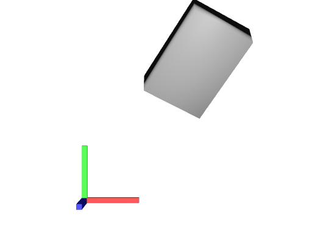
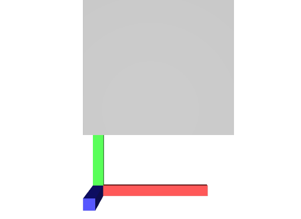

# Transforms

These files showcase different transform operations.

Schema specification: <https://github.com/PixarAnimationStudios/USD/blob/release/pxr/usd/usdGeom/schema.usda>

## Simple Transform

[simple_transform.usda](./simple_transform.usda)

This file shows an example of a mesh with a simple, common stack of transform operations.

```usda
uniform token[] xformOpOrder = [
    "xformOp:translate",
    "xformOp:rotateXYZ",
    "xformOp:scale"
]
```


_simple_transform.usda, usdrecord 22.08_

## Complex Transform

[complex_transform.usda](./complex_transform.usda)

This file shows an example of a mesh with a complex stack of transform operations.

```usda
uniform token[] xformOpOrder = [
    "xformOp:translate",
    "xformOp:translate:rotatePivotOffset",
    "xformOp:translate:rotatePivot",
    "xformOp:rotateXYZ:rotateOffset",
    "xformOp:rotateXYZ",
    "!invert!xformOp:translate:rotatePivot",
    "xformOp:translate:scalePivotOffset",
    "xformOp:translate:scalePivot",
    "xformOp:transform:shear",
    "xformOp:scale:scaleOffset",
    "xformOp:scale",
    "!invert!xformOp:translate:scalePivot"
]
```


_complex_transform.usda, usdrecord 22.08_

## Matrix Transform

[matrix_transform.usda](./matrix_transform.usda)

This file shows an example of a mesh with a matrix transform.

```usda
uniform token[] xformOpOrder = ["xformOp:transform"]
```


_matrix_transform.usda, usdrecord 22.08_

## Weird Matrix Transform

[weird_matrix_transform.usda](./weird_matrix_transform.usda)

This file shows an example of a mesh with a matrix transform with weird, nonsensible values.

```usda
custom Matrix4d xformOp:transform = ((1, 2, 3, 4), (5, 6, 7, 8), (9, 10, 11, 12), (13, 14, 15, 1))
uniform token[] xformOpOrder = ["xformOp:transform"]
```


_weird_matrix_transform.usda, usdrecord 22.08_

## Nested Xforms

[xforms_nested.usda](./xforms_nested.usda)

This file uses nestes `Xforms` to verify that transform operations are correctly applied in order.


_xforms_nested.usda, usdrecord 22.08_

## Nested Scopes and Xforms

[scopes_and_xforms_nested.usda](./scopes_and_xforms_nested.usda)

This file uses nestes `Scopes` and `Xforms` to verify that transform operations are correctly applied in order and that a mix of `Scopes` and `Xforms` doesn't cause issues.


_scopes_and_xforms_nested.usda, usdrecord 22.08_
