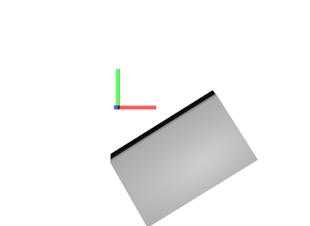

# Complex Transform

## Screenshot


_usdrecord 22.08_

## Description

This file shows an example of a mesh with a complex stack of transform operations.

```usda
uniform token[] xformOpOrder = [
    "xformOp:translate",
    "xformOp:translate:rotatePivotOffset",
    "xformOp:translate:rotatePivot",
    "xformOp:rotateXYZ:rotateOffset",
    "xformOp:rotateXYZ",
    "!invert!xformOp:translate:rotatePivot",
    "xformOp:translate:scalePivotOffset",
    "xformOp:translate:scalePivot",
    "xformOp:transform:shear",
    "xformOp:scale:scaleOffset",
    "xformOp:scale",
    "!invert!xformOp:translate:scalePivot"
]
```

Schema specification: <https://github.com/PixarAnimationStudios/USD/blob/release/pxr/usd/usdGeom/schema.usda>
