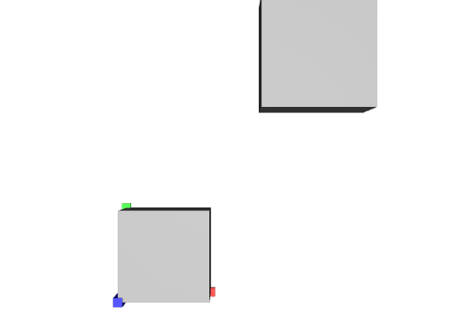

# Nested Scopes and Xforms

## Screenshot

_usdrecord 22.08_

## Description

This file uses nestes `Scopes` and `Xforms` to verify that transform operations are correctly applied in order and that a mix of `Scopes` and `Xforms` doesn't cause issues.

Schema specification: <https://github.com/PixarAnimationStudios/USD/blob/release/pxr/usd/usdGeom/schema.usda>
